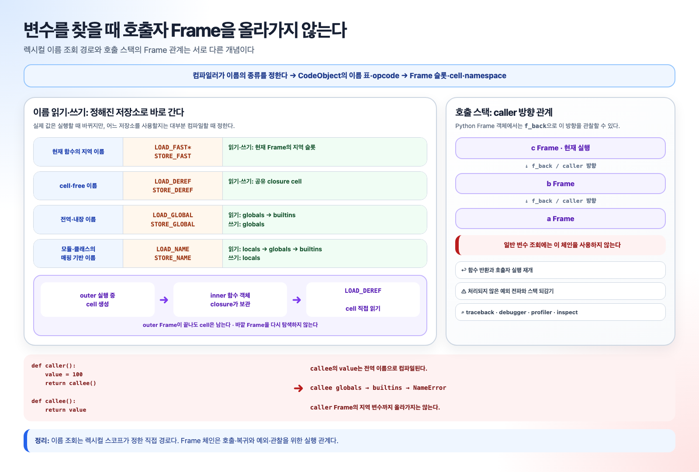

# 이름 분류가 저장소와 opcode를 정한다

Python은 일반 이름을 찾으려고 호출자 Frame을 차례로 올라가지 않는다. 컴파일러가
코드 블록 전체를 분석해 이름을 local·cell·free·global로 분류하면, 그 결과가
CodeObject의 이름 메타데이터와 opcode 선택에 남는다. 실행할 때 달라지는 것은 그
경로가 가리키는 객체다. closure도 바깥 Frame을 나중에 재탐색하는 기능이 아니라,
컴파일 시 선택한 이름을 공유 cell로 전달하는 기능이다.

아래 opcode와 필드 값은 CPython 3.14.6에서 확인했다. 특히 `LOAD_CLOSURE`는 이
버전의 최종 실행 opcode가 아니라 컴파일 중간의 pseudo instruction이라는 점이 이전
버전 설명과 다르다.



## `rate`는 컴파일할 때 cell과 free로 결정된다

최소한의 closure 예제를 보자.

```python
def outer():
    rate = 2

    def inner(x):
        return x * rate

    return inner
```

심볼 테이블은 `rate = 2` 한 줄만 따로 보지 않고 `outer`와 그 안의 `inner`를 함께
분석한다. `rate`는 `outer`에서 대입되므로 처음에는 local로 분류된다. 하지만
`inner`도 같은 `rate`를 읽으므로, `outer`는 이 이름을 일반 local이 아니라
`inner`와 공유할 수 있는 cell로 보관해야 한다. 반대로 `inner`에서 `rate`는 직접
정의하지 않고 바깥 블록에서 전달받는 free variable이다. 분석 결과는 다음과 같다.

```text
outer에서 rate: outer에서 정의되어 inner와 공유됨 → CELL
inner에서 rate: outer에서 전달받아 사용함 → FREE
outer에서 inner: 일반 local
inner에서 x: 매개변수 local
```

같은 관계를 CPython의 내부 심볼 정보로 표현하면 `outer.rate`의 정의 플래그는
`DEF_LOCAL`, 분석된 scope는 `CELL`이다. `inner.rate`에는 사용 플래그 `USE`와
scope `FREE`가 남는다. 구현 수준의 raw `ste_symbols` 값은 scope를
`SCOPE_OFFSET`만큼 옮겨 각각
`DEF_LOCAL | (CELL << SCOPE_OFFSET)`, `USE | (FREE << SCOPE_OFFSET)`로 저장한다.
여기서 cell과 free는 서로 다른 두 이름이 아니다. `outer`와 `inner`가 같은 `rate`
바인딩을 각자의 코드 블록에서 다르게 분류한 것이다.

컴파일할 때 결정되는 것은 `rate`의 값이 아니라 저장 방식이다. 이 시점에는 정수 객체
`2`가 cell에 들어 있지 않다. 나중에 `outer()`가 실행되어 `rate = 2`를 수행할 때
비로소 cell이 `2`를 가리키게 된다.

## CodeObject에는 이름과 슬롯 종류가 남는다

CPython 3.14.6에서 공개 필드는 다음과 같다.

```text
outer.__code__
  co_varnames = ('inner',)
  co_cellvars = ('rate',)
  co_freevars = ()
  co_nlocals  = 1

inner.__code__
  co_varnames = ('x',)
  co_cellvars = ()
  co_freevars = ('rate',)
  co_nlocals  = 1
```

다음은 Python 속성 조회가 아니라 C `PyCodeObject` 내부의
`co_localsplusnames`·`co_localspluskinds`를 단순화한 보기다. 이 메타데이터까지 보면
슬롯 번호가 연결된다.

```text
PyCodeObject 내부 보기: outer
  co_localsplusnames = ('inner', 'rate')
  co_localspluskinds = [LOCAL, CELL]
outer slots: 0=inner, 1=rate cell

PyCodeObject 내부 보기: inner
  co_localsplusnames = ('x', 'rate')
  co_localspluskinds = [LOCAL, FREE]
inner slots: 0=x, 1=rate free cell
```

내부 kind 비트는 이 예에서 각각 `CO_FAST_LOCAL(0x20)`,
`CO_FAST_CELL(0x40)`, `CO_FAST_FREE(0x80)`이다. 공개 `co_varnames`,
`co_cellvars`, `co_freevars`는 이 통합 배열에서 필요한 이름을 골라 보여 준다.
캡처된 매개변수라면 한 슬롯이 `LOCAL | CELL`이고 이름이 `co_varnames`와
`co_cellvars` 양쪽에 나타날 수도 있다.

`LOAD_DEREF 1`의 `1`을 곧바로 `co_freevars[1]`로 읽으면 틀린다. raw
operand는 locals-plus 슬롯 1이고, 그 슬롯이 어떤 이름과 종류인지는 통합
메타데이터로 해석한다.

## outer는 빈 cell을 만들고 실행 중 값을 넣는다

`outer`의 최종 바이트코드는 다음과 같다.

```text
MAKE_CELL                1 (rate)
RESUME                   0
LOAD_SMALL_INT           2
STORE_DEREF              1 (rate)

LOAD_FAST_BORROW         1 (rate)
BUILD_TUPLE              1
LOAD_CONST               1 (<code object inner>)
MAKE_FUNCTION
SET_FUNCTION_ATTRIBUTE   8 (closure)
STORE_FAST               0 (inner)

LOAD_FAST_BORROW         0 (inner)
RETURN_VALUE
```

`outer()` 호출 직후 슬롯 0과 1은 미설정이다. `MAKE_CELL 1`은 슬롯 1에
`PyCellObject`를 만든다. 이 예에서는 빈 cell이지만, 캡처된 매개변수처럼 슬롯에
이미 인수 객체가 있다면 그 객체를 초기 내용으로 가진 cell을 만든다. 이어
`LOAD_SMALL_INT 2`가 정수 객체 참조를 평가 스택에 올리고 `STORE_DEREF 1`이 그
참조를 cell 내용으로 옮긴다.

```text
호출 직후       slot 1: 미설정
MAKE_CELL 1     slot 1: cell → 비어 있음
STORE_DEREF 1   slot 1: cell → int 2
```

local용 `STORE_FAST`가 아니라 `STORE_DEREF`를 쓰는 이유는 슬롯 1에 값 객체가 직접
들어 있지 않고 cell 객체가 들어 있기 때문이다. 이후 `nonlocal rate` 대입이 있다면
같은 cell의 내용 화살표를 바꾸므로 이미 만들어진 모든 inner 함수가 새 내용을 본다.

## `LOAD_CLOSURE`는 3.14에서 최종 opcode가 아니다

컴파일러의 `codegen_make_closure()`는 inner CodeObject의 free-variable 순서를
읽고 outer의 대응 슬롯마다 `LOAD_CLOSURE`를 방출한다. 그러나 3.14에서
`LOAD_CLOSURE`는 `LOAD_FAST`를 대상으로 하는 pseudo instruction이다. CFG 처리에서
`LOAD_FAST`로 낮아지고 load-fast 최적화를 거쳐 위의 최종 `dis`에는
`LOAD_FAST_BORROW 1 (rate)`가 보인다.

여기서 `LOAD_FAST_BORROW`가 올리는 것은 cell 내용 `2`가 아니라 슬롯 1의 cell 객체
참조다. `BUILD_TUPLE 1`은 `(rate_cell,)`을 만들고, `MAKE_FUNCTION`은 inner
CodeObject와 globals로 함수 객체를 만든다. `SET_FUNCTION_ATTRIBUTE 8`이 앞서 만든
튜플을 그 함수의 `func_closure`, 즉 Python 수준의 `__closure__`에 붙인다.

```text
outer slot 1 ─→ rate cell ─→ int 2
                    ↑
inner.__closure__[0]┘
```

closure tuple의 순서는 inner의 free-variable 순서와 같다. 이 예에서는 둘 다 하나라서
`inner.__code__.co_freevars[0] == 'rate'`와 `inner.__closure__[0]`이 짝을 이룬다.
이 순서가 어긋나면 이름이 다른 cell을 읽게 되므로 CodeObject와 함수 객체를 임의로
조립할 때도 길이와 순서가 맞아야 한다.

## inner 호출은 같은 cell을 free 슬롯에 복사한다

inner의 최종 바이트코드는 다음과 같다.

```text
COPY_FREE_VARS           1
RESUME                   0
LOAD_FAST_BORROW         0 (x)
LOAD_DEREF               1 (rate)
BINARY_OP                5 (*)
RETURN_VALUE
```

`inner(5)`를 호출하면 먼저 Frame이 생기고 인수 결합이 슬롯 0에 정수 객체 `5`를
놓는다. free 슬롯 1은 아직 비어 있다. 첫 opcode `COPY_FREE_VARS 1`은 함수 객체의
`func_closure[0]`에서 cell 객체 참조를 가져와 Frame의 마지막 free-variable 슬롯,
여기서는 슬롯 1에 넣는다. 값을 새 cell로 복사하지 않는다.

```text
Frame 초기화       slot 0: x → 5       slot 1: 미설정
COPY_FREE_VARS 1   slot 0: x → 5       slot 1: ─┐
inner.__closure__[0] ────────────────────────────┴→ 같은 rate cell → 2
LOAD_DEREF 1       평가 스택에 cell의 현재 내용 2를 올림
```

outer Frame이 반환되어 사라져도 inner는 동작한다. cell의 수명은 원래 Frame
자체가 아니라 `inner.__closure__`와 활성 inner Frame 같은 강한 참조로 결정된다.
closure는 “바깥 Frame을 보관한다”가 아니라 “필요한 바인딩 저장소만 보관한다”가 더
정확하다.

## 어떤 이름이 closure인지는 정적이고 어떤 객체인지는 동적이다

“어떤 값이 클로저인지는 바이트코드에 있는가?”라는 질문은 이름과 객체를 나눠 답해야
한다. `co_cellvars`, `co_freevars`, locals-plus kind, `MAKE_CELL`, closure tuple 생성,
`COPY_FREE_VARS`, `LOAD_DEREF`에는 어떤 이름과 슬롯을 공유할지가 정적으로 들어 있다.
반면 cell 안의 현재 객체는 실행 결과다.

이 예제의 `2`는 우연히 `LOAD_SMALL_INT 2`라는 immediate에도 보이지만, 이것이
“closure 값 표”는 아니다. `rate = read_config()`, 매개변수 캡처, 조건부 대입,
`nonlocal` 재대입이라면 같은 바이트코드 구조의 cell 내용이 호출마다 달라진다.

또 다른 흔한 오해는 호출자 지역 변수도 비슷하게 찾을 것이라는 생각이다.

```python
def caller():
    value = 100
    return callee()

def callee():
    return value
```

`callee` 본문의 이름 `value`는 free가 아니라 implicit global이다. `LOAD_GLOBAL`은
callee 함수의 globals와 builtins만 보고, `caller`의 local 슬롯까지 올라가지 않는다. Frame의
`previous` 연결은 복귀·예외·traceback 관계이고 렉시컬 이름 조회 경로가 아니다.

이 설명은 최적화된 일반 함수 scope를 중심으로 한다. 모듈과 클래스 본문은
`LOAD_NAME`, annotation scope와 클래스 안의 free 이름은
`LOAD_FROM_DICT_OR_DEREF` 같은 추가 경로를 쓸 수 있다. opcode 이름과
`LOAD_CLOSURE`의 pseudo-op 처리도 CPython 버전에 따라 바뀌며 공개 호환 규격이
아니다. GIL 빌드와 자유 스레딩 빌드는 cell이라는 의미를 공유하지만 내부 참조 증감과
동기화 표현은 다를 수 있다.

---

[설명 문서 목록](README.ko.md)

이전:

[실행 설계와 호출 상태](execution-model.ko.md)

다음:

[평가 루프와 세 가지 스택](evaluation-loop.ko.md)

관련 글:

- [객체 참조와 수명](objects-and-lifetimes.ko.md)
- [CodeObject 필드와 바이트코드 인자](../reference/code-object-and-bytecode.ko.md)
