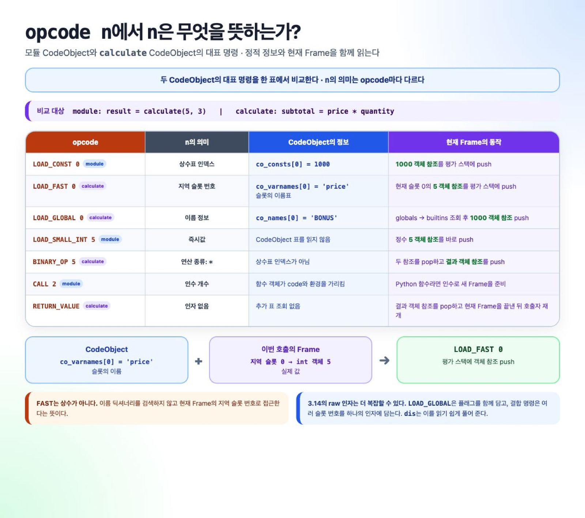

# CodeObject 필드와 바이트코드 인자 참조

이 문서는 CPython 3.14의 CodeObject와 `dis` 출력을 조회할 때 쓰는
참조 자료다. 개념이 필요하면 [실행 설계와 호출 상태](../explanations/execution-model.ko.md)를,
직접 확인해 보고 싶다면 [소스에서 반환값까지 추적하기](../tutorial/guide-source-to-execution.ko.md)를
먼저 읽으면 된다. Function·CodeObject·Frame 사이에서 정보가 어디에 저장되는지는
[함수 관련 정보의 저장 위치](function-and-runtime-storage.ko.md)에서 조회한다.

> CPython 바이트코드는 버전 간 호환 형식이 아니다. 결합 opcode,
> 특수화, raw 인자는 마이크로 버전에서도 달라질 수 있다. 예제의
> 출력은 CPython 3.14.6 기준이다.



## 공개 CodeObject 필드

| 필드 | 내용 | 주로 연결되는 명령·동작 |
|---|---|---|
| `co_consts` | 상수와 중첩 CodeObject | `LOAD_CONST` |
| `co_names` | global, mapping name, 속성, import 등에 쓰는 이름 문자열 | `LOAD_GLOBAL`, `LOAD_NAME`, `LOAD_ATTR`, `IMPORT_NAME` 등 |
| `co_varnames` | 인수를 포함한 지역 이름 | 일반 local의 `FAST` 슬롯 설명 |
| `co_cellvars` | 현재 블록의 local 중 안쪽 렉시컬 코드가 캡처한 이름 | cell 슬롯 |
| `co_freevars` | 바깥 렉시컬 영역에서 받은 이름 | 함수 `__closure__`의 cell 순서 |
| `co_argcount`, `co_posonlyargcount`, `co_kwonlyargcount` | 인수 배치 정보 | 함수 호출 Frame 초기화 |
| `co_nlocals` | 일반 지역 변수 수 | 지역 저장 공간 계산 |
| `co_stacksize` | 필요한 평가 스택의 최대 깊이 | Frame 크기 계산 |
| `co_flags` | 함수·제너레이터·코루틴 등의 성질 | 호출과 객체 생성 경로 |
| `co_code` | Python에서 관찰하는 바이트코드 bytes | `dis`, marshal |
| `co_linetable`, `co_positions()` | 명령과 소스 위치의 대응 | traceback, debugger, coverage |
| `co_exceptiontable` | 보호 범위, handler, 복구할 스택 깊이 | 예외 처리 |
| `co_filename`, `co_name`, `co_qualname`, `co_firstlineno` | 코드의 출처와 표시 이름 | 오류·관찰 도구 |

`co_linetable`의 내부 entry 형식은
[런타임 객체 참고 자료](runtime-objects.ko.md#co_linetable-조회표)에서 조회한다.

CPython 내부에서는 `co_localsplusnames`와 `co_localspluskinds`가 local,
cell, free 슬롯을 한 배열로 설명한다. 공개 `co_varnames`, `co_cellvars`,
`co_freevars`의 인덱스를 raw locals-plus 인자와 같은 것으로 해석하면 안 된다.

`PyCodeObject` 자체도 PyObject다. 현재 호출의 지역 값과 평가 스택, 명령
위치는 CodeObject가 아니라 Frame에 놓인다. globals와 기본 인수, closure는
함수 객체가 연결한다.

## 바이트코드 인자의 종류

`opcode n`의 `n`은 명령마다 다르게 해석한다.

| 인자 종류 | 예 | 해석 |
|---|---|---|
| 상수·이름 표 인덱스 | `LOAD_CONST 0`, `LOAD_NAME 1` | `co_consts[0]`, `co_names[1]` |
| Frame 슬롯 | `STORE_FAST 2` | 현재 Frame의 locals-plus 슬롯 2 |
| 즉시값 | `LOAD_SMALL_INT 5` | 정수 5 자체 |
| 연산 종류 | `BINARY_OP 5` | 3.14에서 곱셈 연산 번호 |
| 개수 | `CALL 2`, `COPY_FREE_VARS 1` | 인수 또는 복사할 cell 참조 수 |
| 상대 이동량 | `JUMP_* n` | 현재 기준점에서 이동할 instruction delta |
| 비트로 묶은 값 | 결합 `FAST` 명령 | 여러 슬롯 번호나 플래그를 한 인자에 저장 |

raw 인자를 직접 읽을 때는 `dis.Instruction.argval`과 `argrepr`을 함께
확인하는 편이 안전하다.

## 자주 혼동하는 3.14 인자

| 명령 | raw 인자 해석 | 실행 위치 |
|---|---|---|
| `LOAD_CONST n` | `co_consts[n]` | 상수를 평가 스택에 올린다. |
| `LOAD_FAST* n` | locals-plus 슬롯 `n` | 현재 Frame의 지역 값을 읽는다. |
| `STORE_FAST n` | locals-plus 슬롯 `n` | 평가 스택 값을 지역 슬롯에 저장한다. |
| `LOAD_DEREF n` | locals-plus의 cell 슬롯 `n` | cell 내용을 읽는다. `co_freevars[n]` 직접 인덱스가 아니다. |
| `LOAD_GLOBAL n` | 이름은 `co_names[n >> 1]`; 최하위 비트는 호출 규약의 `NULL` 플래그 | globals, 없으면 builtins |
| `STORE_GLOBAL n` | 이름은 `co_names[n]` | globals에 저장 |
| `LOAD_NAME n` | 이름은 `co_names[n]` | locals → globals → builtins |
| `STORE_NAME n` | 이름은 `co_names[n]` | 현재 locals 매핑에 저장 |
| `BINARY_OP n` | `n`은 연산 번호 | 피연산자를 pop하고 결과를 push |
| `CALL n` | 위치 인수와 키워드 값을 포함한 호출 인수 수 | callable 호출 결과를 push |

CPython 3.14.6의 결합 명령
`LOAD_FAST_BORROW_LOAD_FAST_BORROW n`은 두 슬롯을 nibble에 담는다.

```text
첫 슬롯 = n >> 4
둘째 슬롯 = n & 15
```

`BORROW`는 내부 stack reference 관리 방식이다. Python 코드의 동작을 읽을
때는 현재 Frame 슬롯의 객체를 평가 스택에서 사용한다고 이해하면 충분하다.

## 공개 바이트코드와 내부 실행 버퍼

CPython 3.14의 `_Py_CODEUNIT`은 기본적으로 2바이트이며 opcode 1바이트와
인자 1바이트로 구성된다. 큰 인자는 `EXTENDED_ARG`로 이어 붙인다.

Python에서 보이는 `code.co_code`와 내부 `co_code_adaptive[]`는 같은 버퍼가
아니다. 실행 중 내부 명령은 관찰한 타입과 네임스페이스 배치에 맞게
특수화될 수 있다. 자세한 흐름은
[특수화와 JIT](../explanations/specialization-and-jit.ko.md)에서 설명한다.

## 관련 CPython 3.14 소스

| 역할 | 파일 |
|---|---|
| CodeObject 정의 | `Include/cpython/code.h` |
| CodeObject 생성·관리 | `Objects/codeobject.c` |
| 컴파일 단계 조율 | `Python/compile.c` |
| 이름·scope 분석 | `Python/symtable.c` |
| AST에서 의사 명령 생성 | `Python/codegen.c` |
| CFG와 최적화 | `Python/flowgraph.c` |
| 바이트코드·테이블 조립 | `Python/assemble.c` |
| opcode DSL | `Python/bytecodes.c` |
| 생성된 실행 case | `Python/generated_cases.c.h` |
| 평가 루프 진입점 | `Python/ceval.c` |
| opcode 메타데이터 | `Include/internal/pycore_opcode_metadata.h` |

세부 C 구조와 생성 순서는 [기존 컴파일러 문서](../../../cpython-internals-notes/3.14/compiling-python-source-code/README.ko.md#8-코드-객체),
실제 예제 해석은 [기존 실행 문서](../../../cpython-internals-notes/3.14/compilation-to-execution/README.ko.md#5-바이트코드-opcode-n에서-n은-무엇인가)에
남아 있다.

[가이드 홈](../README.ko.md)
