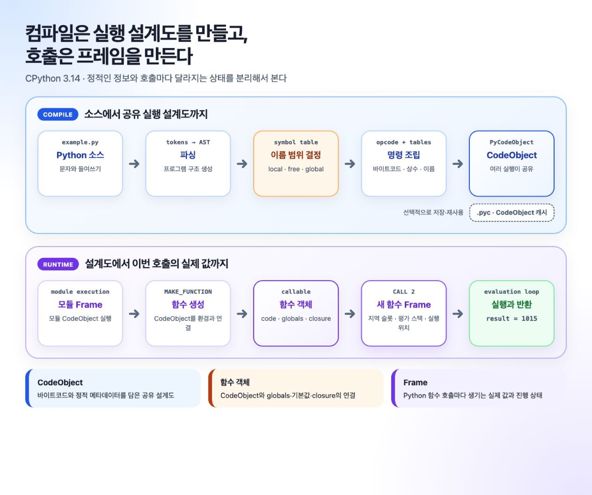
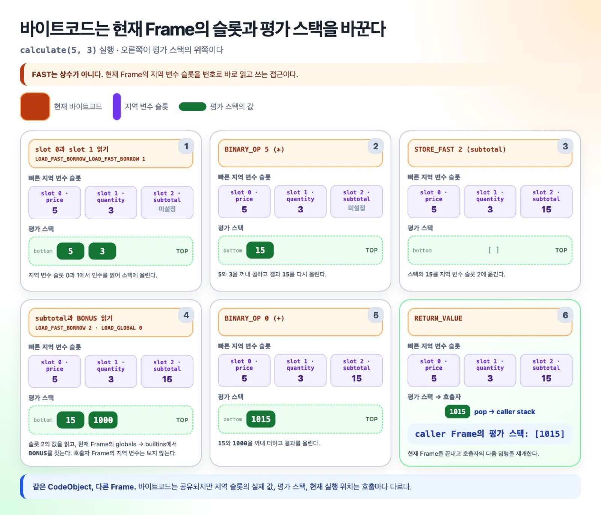

# 짧은 함수를 소스에서 반환값까지 추적하기

이 실습은 CPython 3.14.6에서 `compile()`과 `dis`로 모듈 CodeObject와
함수 CodeObject를 나눠 보고, 함수 호출의 지역 슬롯과 평가 스택이
`1015`를 만드는 과정을 확인한다. Python 문법과 함수 호출을 알고 있으면
따라갈 수 있다.

> 바이트코드는 CPython 내부 형식이다. 다른 CPython 버전에서는 opcode
> 이름, 결합 방식, 인자 값이 달라질 수 있다.



## CPython 3.14 실행 파일을 확인한다

시스템 기본 `python`이 아니라 CPython 3.14로 실행해야 한다.

```shell
python3.14 --version
```

출력이 `Python 3.14.x`인지 확인한다. 아래 코드는 하나의
`trace_execution.py` 파일에 위에서 아래로 이어 붙인 뒤 실행하면 된다.

```shell
python3.14 trace_execution.py
```

Windows에서는 `py -3.14 trace_execution.py`를 쓸 수 있다. 이 실습의 이름 표와
결과는 3.14 계열에서 같지만, 결합 opcode와 raw 인자가 3.14.6 출력과 다르면
자신의 `dis` 결과를 기준으로 읽는다.

## 예제를 문자열로 준비한다

먼저 컴파일할 소스를 문자열로 만든다.

```python
import dis
import types

source = """\
BONUS = 1000

def calculate(price, quantity):
    subtotal = price * quantity
    return subtotal + BONUS

result = calculate(5, 3)
"""

module_code = compile(source, "example.py", "exec")
```

`compile()`은 코드를 실행하지 않는다. 이 시점에는 `BONUS`도 저장되지
않았고 `calculate(5, 3)`도 호출되지 않았다. 실행 방법만 CodeObject에
기록됐다.

## 모듈과 함수 CodeObject를 분리한다

함수 본문은 모듈 CodeObject의 상수 안에 별도 CodeObject로 들어 있다.

```python
function_code = next(
    value
    for value in module_code.co_consts
    if isinstance(value, types.CodeType)
)

print(module_code.co_names)
print(function_code.co_names)
print(function_code.co_varnames)
```

출력은 다음과 같다.

```text
('BONUS', 'calculate', 'result')
('BONUS',)
('price', 'quantity', 'subtotal')
```

`co_names`와 `co_varnames`에는 이름 문자열이 있다. 이번 실행의 값
`1000`, `5`, `3`, `15`가 들어 있는 딕셔너리는 아니다.

## 바이트코드가 어느 표와 슬롯을 읽는지 확인한다

```python
dis.dis(module_code, depth=0, adaptive=False, show_caches=False)
dis.dis(function_code, adaptive=False, show_caches=False)
```

모듈 코드의 핵심 명령은 다음 흐름이다.

```text
LOAD_CONST 0       → 상수 1000 적재
STORE_NAME 0       → co_names[0]인 BONUS에 저장
LOAD_CONST 1       → calculate CodeObject 적재
MAKE_FUNCTION      → 함수 객체 생성
STORE_NAME 1       → calculate에 저장
LOAD_NAME 1        → 함수 객체 적재
PUSH_NULL          → 일반 호출 규약의 NULL 표식 적재
LOAD_SMALL_INT 5   → 첫 번째 인수 적재
LOAD_SMALL_INT 3   → 두 번째 인수 적재
CALL 2             → 인수 두 개로 호출
STORE_NAME 2       → 반환값을 result에 저장
```

함수 코드에서는 저장 위치가 달라진다.

```text
LOAD_FAST_BORROW_LOAD_FAST_BORROW 1 (price, quantity)
BINARY_OP                            5 (*)
STORE_FAST                           2 (subtotal)
LOAD_FAST_BORROW                     2 (subtotal)
LOAD_GLOBAL                          0 (BONUS)
BINARY_OP                            0 (+)
RETURN_VALUE
```

`FAST`는 상수가 빠르다는 뜻이 아니다. 컴파일할 때 번호를 정한 현재
Frame의 지역 슬롯을 딕셔너리 검색 없이 읽는다는 뜻이다.

## 호출별 Frame에 실제 값을 놓는다

`exec()`로 모듈 코드를 실행한다.

```python
namespace = {}
exec(module_code, namespace)
assert namespace["result"] == 1015
```

`CALL 2`가 Python 함수 객체를 호출하면 새 Frame이 준비된다. CodeObject는
공유하지만 슬롯의 값은 이번 호출에 속한다.

```text
calculate Frame
├─ 슬롯 0 price       ─→ 정수 객체 5
├─ 슬롯 1 quantity    ─→ 정수 객체 3
├─ 슬롯 2 subtotal    ─→ 처음에는 미설정
└─ globals            ─→ BONUS가 있는 모듈 네임스페이스
```

## 평가 스택에서 결과가 만들어지는 순서를 따라간다



```text
[]
→ [5, 3]          LOAD_FAST 계열
→ [15]            BINARY_OP *
→ []              STORE_FAST subtotal
→ [15, 1000]      LOAD_FAST + LOAD_GLOBAL
→ [1015]          BINARY_OP +
→ []              RETURN_VALUE
```

평가 스택에는 계산 중간값의 객체 참조가 잠시 머문다. 지역 슬롯에는 이번
호출 동안 다시 쓸 값이 남는다. `RETURN_VALUE`는 `1015`의 참조를 호출자
Frame의 평가 스택으로 돌려보낸다.

## 확인한 관계를 다음 설명으로 확장한다

이 실습에서 확인한 핵심은 하나다. CodeObject는 실행 설계이고, Frame은
그 설계를 한 번 실행할 때의 값과 상태다.

- 역할을 더 정확히 구분하려면 [실행 설계와 호출 상태](../explanations/execution-model.ko.md)를 읽는다.
- `FAST`, `GLOBAL`, closure의 저장 위치는 [이름과 closure](../explanations/names-and-closures.ko.md)에서 이어진다.
- 각 필드와 raw opcode 인자는 [CodeObject와 바이트코드 참조](../reference/code-object-and-bytecode.ko.md)에서 찾는다.

[가이드 홈](../README.ko.md) · 다음: [소스에서 CodeObject까지](../explanations/source-to-code-object.ko.md)
