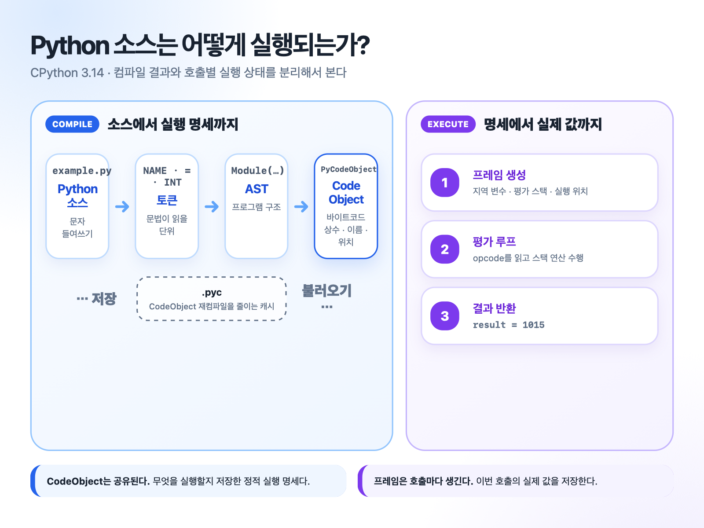
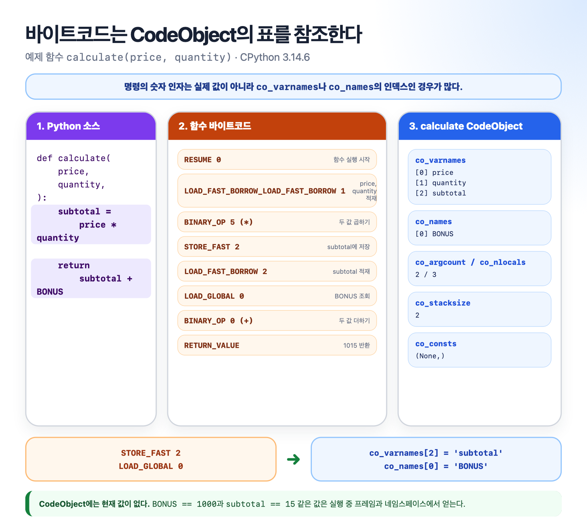
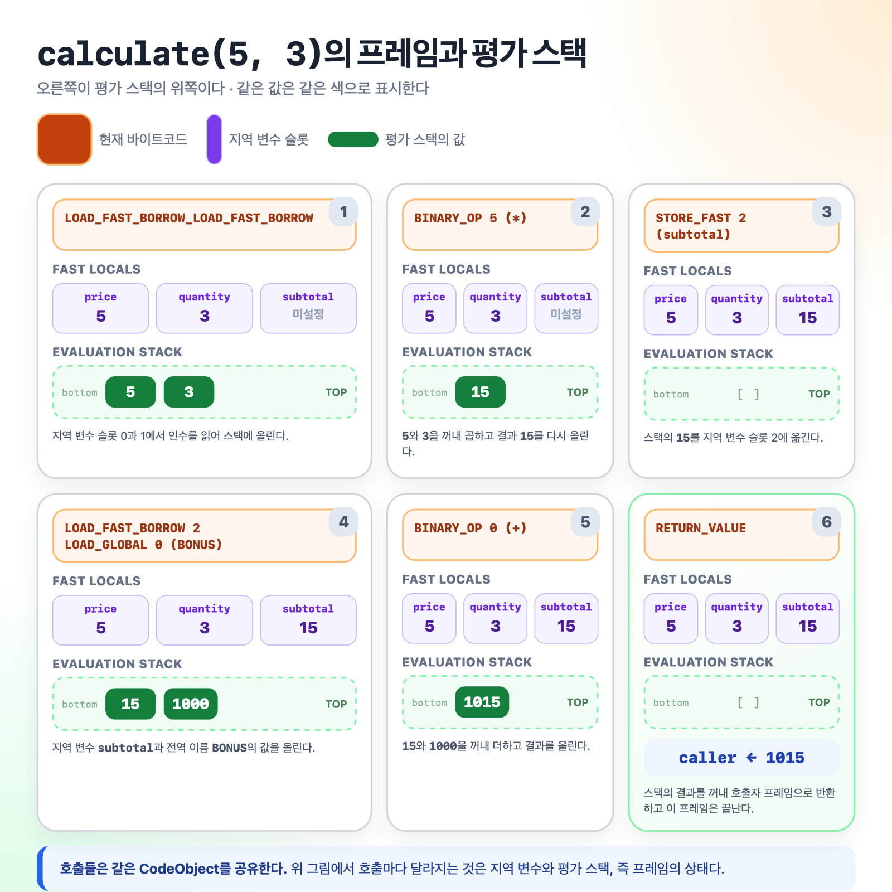
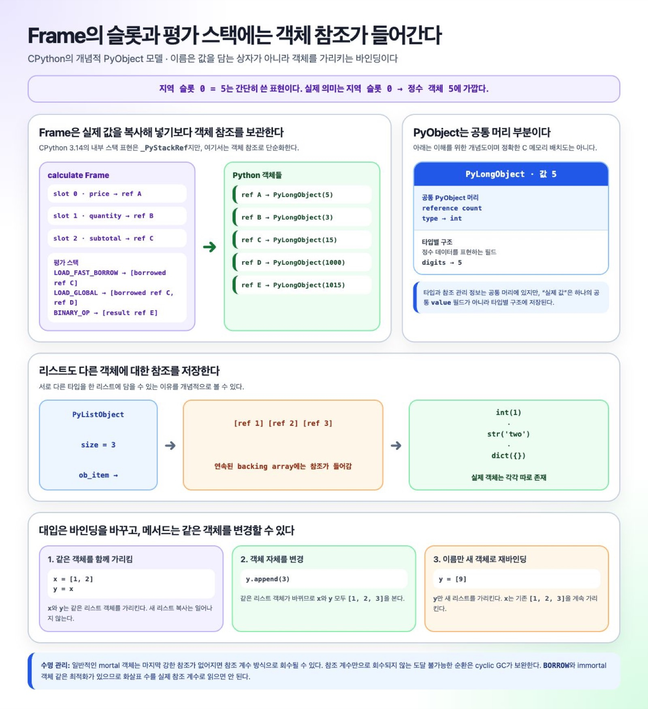
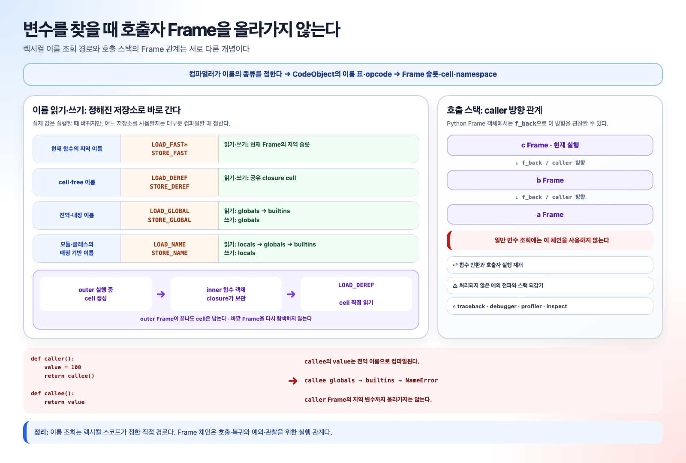

# CPython 3.14: Python 컴파일에서 실행까지

이 문서는 짧은 Python 예제 하나가 CPython 3.14에서 컴파일되고
실행되는 과정을 따라간다. C 구조체나 평가 루프의 구현보다 다음
관계를 이해하는 데 집중한다.

```text
소스 코드 → CodeObject → 함수 객체 → Frame → PyObject 참조를 이용한 실행 → 결과
```

특히 다음 질문에 답한다.

- 바이트코드의 숫자 인자는 무엇을 가리키는가?
- `FAST`는 왜 상수가 아니라 지역 변수 접근인가?
- local, cell, free, global 이름은 무엇이 다른가?
- `co_names`와 실제 이름 딕셔너리는 어떻게 연결되는가?
- CodeObject와 Frame에는 각각 무엇이 들어 있는가?
- Frame의 지역 슬롯과 평가 스택에는 실제로 무엇이 들어 있는가?
- 변수를 찾을 때 호출자 Frame을 차례로 올라가는가?

이 문서의 출력은 **CPython 3.14.6**에서 확인했다. CPython 바이트코드는
버전 사이의 호환성을 보장하는 공개 명령어 규격이 아니므로 다른
버전에서는 명령 이름과 배치가 달라질 수 있다.

내부 구현을 더 자세히 보고 싶다면 다음 문서를 참고한다.

- [Python 소스 코드 컴파일](../compiling-python-source-code/README.ko.md)
- [런타임 객체](../runtime-objects/README.ko.md)
- [프로그램 실행](../program-execution/README.ko.md)

## 먼저 잡을 실행 모델



먼저 CodeObject, 함수 객체, Frame, PyObject의 역할을 분리해야 한다.

| 구성 요소 | 역할 | 언제 달라지는가? |
|---|---|---|
| CodeObject | 바이트코드, 상수, 이름, 지역 변수 구조 같은 실행 설계도를 저장한다. | 같은 코드의 여러 실행이 공유한다. |
| 함수 객체 | CodeObject를 globals, 기본 인수, closure 같은 실행 환경과 연결한다. | `def`가 실행될 때 만들어진다. |
| Frame | 이번 실행의 실제 지역 변수, 평가 스택, 현재 실행 위치를 저장한다. | Python 함수가 호출될 때마다 만들어진다. |
| PyObject 계열 객체 | 정수, 문자열, 리스트, 함수 등 Python에서 다루는 값을 표현한다. | 표현식의 결과로 새로 만들어지거나 기존 객체가 재사용된다. |

### 계층이라기보다 서로 가리키는 관계다

이들을 `함수 객체 → Frame → CodeObject` 같은 단일 소유 계층으로 보면
안 된다. 일반적인 Python 함수 호출의 관계는 다음에 가깝다.

```text
함수 객체 ─────────────→ CodeObject
    │                      실행 설계도
    │ 호출할 때마다
    ├────────→ Frame A ──→ 같은 CodeObject
    └────────→ Frame B ──→ 같은 CodeObject
                 │
                 └─ 지역 슬롯·평가 스택 ─→ 여러 Python 객체 참조
```

따라서 **Frame이 실행할 CodeObject를 가리킨다**는 말은 맞다. 하지만
함수 객체가 호출별 Frame을 하나씩 자기 안에 보관하는 것은 아니다.
함수 객체는 CodeObject와 실행 환경을 가지고 있고, 호출할 때마다 그
정보를 이용해 새 Frame이 준비된다. 재귀 호출에서는 같은 함수 객체와
CodeObject에 연결된 Frame이 동시에 여러 개 존재할 수 있다.

종류 관점에서는 CodeObject와 함수 객체도 Python 객체다. 반면
interpreter Frame은 우선 내부 실행 레코드이며, 필요할 때 Python에서
관찰할 수 있는 Frame 객체와 연결된다.

평가 루프는 CodeObject에서 다음 바이트코드를 읽어 현재 Frame에
적용한다.

```text
execute(opcode, argument, current_frame)
```

CodeObject에는 `price`라는 지역 변수의 이름과 슬롯 구조가 있다.
그러나 이번 호출에서 `price == 5`인지 `price == 8`인지는 Frame의
슬롯이 어떤 정수 객체를 가리키는지에 따라 정해진다.

```text
CodeObject: co_varnames[0] = 'price'

Frame A: 지역 슬롯 0 ─→ 정수 객체 5
Frame B: 지역 슬롯 0 ─→ 정수 객체 8
```

## 끝까지 따라갈 예제

```python
BONUS = 1000

def calculate(price, quantity):
    subtotal = price * quantity
    return subtotal + BONUS

result = calculate(5, 3)
```

최종 결과는 다음과 같다.

```python
result == 1015
```

이 예제로 다음을 한 번에 볼 수 있다.

- 모듈 전역 이름 `BONUS`, `calculate`, `result`
- 함수 지역 변수 `price`, `quantity`, `subtotal`
- 함수 CodeObject의 생성과 함수 호출
- 지역 변수 슬롯과 평가 스택의 변화
- 전역 이름 조회와 반환값 전달

## 1. 컴파일: 실행 방법을 미리 정한다

CPython 컴파일러의 주요 단계는 다음과 같다.

```text
소스
  ↓ 토큰화와 파싱
AST
  ↓ 심볼 테이블 분석
이름을 local · cell/free · global 등으로 분류
  ↓ 명령 생성, CFG 최적화, 조립
CodeObject
```

조금 더 풀면 다음 순서다.

1. 소스를 토큰으로 나눈다.
2. 토큰을 파싱해 AST를 만든다.
3. 심볼 테이블을 만들며 각 이름의 범위를 정한다.
4. AST를 바이트코드에 가까운 명령어 열로 바꾼다.
5. 제어 흐름 그래프를 구성하고 최적화한다.
6. 바이트코드와 위치·예외 테이블을 CodeObject로 묶는다.

Python에서는 `compile()`로 이 결과를 직접 얻을 수 있다.

```python
source = """\
BONUS = 1000

def calculate(price, quantity):
    subtotal = price * quantity
    return subtotal + BONUS

result = calculate(5, 3)
"""

module_code = compile(source, "example.py", "exec")
```

이 시점에는 `BONUS`가 저장되거나 `calculate(5, 3)`이 호출되지 않았다.
무엇을 어디에서 읽고 어떤 연산을 할지만 정해졌다.

```text
컴파일 시점: 이름의 종류와 조회 방법을 정한다.
실행 시점:   그 조회 방법으로 이번 실행의 실제 값을 읽는다.
```

## 2. 컴파일 결과: 모듈과 함수 CodeObject

파일 전체는 모듈 CodeObject가 된다. 함수 본문도 별도의 CodeObject로
미리 컴파일되어 모듈 CodeObject의 상수에 들어간다.

```text
module CodeObject
├─ co_consts[0] = 1000
├─ co_consts[1] = calculate CodeObject
└─ co_consts[2] = None
```

모듈 CodeObject의 주요 값은 다음과 같다.

```text
co_name      = '<module>'
co_argcount  = 0
co_nlocals   = 0
co_stacksize = 4
co_flags     = 0

co_consts = (
    1000,
    <code object calculate ...>,
    None,
)

co_names    = ('BONUS', 'calculate', 'result')
co_varnames = ()
```

함수 CodeObject의 주요 값은 다음과 같다.

```text
co_name        = 'calculate'
co_firstlineno = 3
co_argcount    = 2
co_nlocals     = 3
co_stacksize   = 2
co_flags       = 3

co_consts   = (None,)
co_names    = ('BONUS',)
co_varnames = ('price', 'quantity', 'subtotal')
co_cellvars = ()
co_freevars = ()
```

두 CodeObject의 필드를 비교하면 다음과 같다.

| 필드 | 모듈 코드 | 함수 코드 | 용도 |
|---|---|---|---|
| `co_consts` | `1000`, 함수 코드, `None` | `None` | `LOAD_CONST`가 읽을 상수와 중첩 코드 |
| `co_names` | `BONUS`, `calculate`, `result` | `BONUS` | 전역·모듈·속성 이름 명령에 사용할 이름 |
| `co_varnames` | 없음 | `price`, `quantity`, `subtotal` | 일반 지역 변수 슬롯의 이름 |
| `co_argcount` | `0` | `2` | 함수 인수 배치에 필요한 정보 |
| `co_nlocals` | `0` | `3` | 일반 지역 변수의 개수 |
| `co_stacksize` | `4` | `2` | 필요한 평가 스택의 최대 깊이 |

`co_names`, `co_varnames`, `co_cellvars`, `co_freevars`는 이름 문자열과
분류 정보를 담는 메타데이터다. 현재 실행의 `이름 → 객체` 바인딩은
담지 않는다. 실제 저장소와의 연결은
[8절](#이름-분류에서-저장소와-opcode까지)에서 설명한다.

`def calculate(...):`를 실행할 때 함수 본문을 다시 파싱하거나 컴파일하지
않는다. 이미 만든 `calculate CodeObject`를 꺼내 함수 객체로 감싼다.

`co_flags == 3`은 이 예제에서 `CO_OPTIMIZED | CO_NEWLOCALS`가 설정된
값이다. 함수 호출마다 독립적인 지역 실행 공간을 사용한다는 정도로
이해하면 충분하다.

## 3. 모듈 실행: 이름을 저장하고 함수를 호출한다

`dis`는 CodeObject의 바이트열을 사람이 읽을 수 있는 명령으로 풀어
준다.

```python
import dis

dis.dis(module_code, depth=0, adaptive=False, show_caches=False)
```

CPython 3.14.6의 모듈 바이트코드는 다음과 같다.

```text
  0           RESUME                   0

  1           LOAD_CONST               0 (1000)
              STORE_NAME               0 (BONUS)

  3           LOAD_CONST               1 (<code object calculate ...>)
              MAKE_FUNCTION
              STORE_NAME               1 (calculate)

  7           LOAD_NAME                1 (calculate)
              PUSH_NULL
              LOAD_SMALL_INT           5
              LOAD_SMALL_INT           3
              CALL                     2
              STORE_NAME               2 (result)
              LOAD_CONST               2 (None)
              RETURN_VALUE
```

이 명령은 세 덩어리로 읽을 수 있다.

### `BONUS = 1000`

```text
LOAD_CONST 0
→ co_consts[0]의 1000을 모듈 Frame의 평가 스택에 올림

STORE_NAME 0
→ co_names[0]의 'BONUS'를 확인
→ 평가 스택의 1000을 모듈 locals에 저장
```

#### `co_names`와 이름 딕셔너리는 다르다

`co_names`는 바이트코드가 사용할 **이름 문자열 표**다.

```text
모듈 CodeObject.co_names[0] ─→ 문자열 'BONUS'
                                      │ STORE_NAME 0
                                      ▼
모듈 locals['BONUS']         ─→ 정수 객체 1000
```

`STORE_NAME 0`은 `co_names[0]`에서 키 `'BONUS'`를 얻고, 평가 스택에서
꺼낸 객체 참조를 현재 locals 매핑에 저장한다. `co_names[0]`에 값
`1000`이 들어 있는 것은 아니다.

### `def calculate(...)`

```text
LOAD_CONST 1
→ co_consts[1]의 calculate CodeObject를 올림

MAKE_FUNCTION
→ CodeObject를 현재 globals와 연결한 함수 객체 생성

STORE_NAME 1
→ 함수 객체를 calculate라는 이름에 저장
```

### `calculate(5, 3)`

```text
LOAD_NAME 1       → calculate 함수 객체 적재
PUSH_NULL         → 내부 호출 규약 표식 적재
LOAD_SMALL_INT 5  → 정수 5를 바로 적재
LOAD_SMALL_INT 3  → 정수 3을 바로 적재
CALL 2            → 인수 두 개로 callable 호출
STORE_NAME 2      → 반환값을 result에 저장
```

`PUSH_NULL`이 올리는 값은 Python의 `None`이 아니다. CPython 내부 호출
규약에서 사용하는 표식이다.

또한 `5`와 `3`은 이 예제의 `co_consts`에 없다. CPython 3.14의
`LOAD_SMALL_INT`가 작은 정수를 명령 인자에서 바로 사용하기 때문이다.

## 4. 함수 호출: 같은 CodeObject, 서로 다른 Frame

함수 객체는 CodeObject만 갖고 있는 것이 아니다. 함수가 정의된
globals, 기본 인수, 키워드 기본값, closure 같은 실행 환경도 함께
가리킨다.

```text
calculate 함수 객체
├─ CodeObject
├─ globals
├─ defaults / kwdefaults
└─ closure
```

`CALL n`은 callable과 인수를 꺼내 호출하고 결과를 호출자의 평가
스택에 올린다. 호출 대상이 Python 함수라면 그 함수의 CodeObject와
인수로 새 interpreter Frame을 준비한다. builtin이나 C callable은 새
Python Frame을 만들지 않을 수 있다.

```text
calculate CodeObject 하나
       │
       ├─ calculate(5, 3) 호출 → Frame A
       └─ calculate(8, 2) 호출 → Frame B
```

두 호출이 공유하는 것은 실행 설계도다. 실제 값과 실행 위치는 각
Frame에 따로 있다.

```text
Frame A
├─ code              → calculate CodeObject
├─ 지역 슬롯          → price=5, quantity=3, subtotal=미설정
├─ 평가 스택          → []
├─ globals/builtins   → 전역 이름 조회에 사용할 네임스페이스
└─ 현재 실행 위치     → 첫 명령

Frame B
├─ code              → 같은 calculate CodeObject
├─ 지역 슬롯          → price=8, quantity=2, subtotal=미설정
└─ 나머지 실행 상태   → Frame A와 독립적
```

## 5. 바이트코드: `opcode n`에서 `n`은 무엇인가

함수 CodeObject의 바이트코드는 다음과 같다.

```python
function_code = next(
    value
    for value in module_code.co_consts
    if isinstance(value, type(module_code))
)

dis.dis(function_code, adaptive=False, show_caches=False)
```

```text
  3           RESUME                   0

  4           LOAD_FAST_BORROW_LOAD_FAST_BORROW 1 (price, quantity)
              BINARY_OP                5 (*)
              STORE_FAST               2 (subtotal)

  5           LOAD_FAST_BORROW         2 (subtotal)
              LOAD_GLOBAL              0 (BONUS)
              BINARY_OP                0 (+)
              RETURN_VALUE
```



바이트코드 뒤의 숫자는 항상 CodeObject 테이블의 인덱스가 아니다.
명령마다 의미가 다르다.

| 인자의 종류 | 예 | 의미 |
|---|---|---|
| CodeObject 테이블 인덱스 | `LOAD_CONST 0`, `LOAD_NAME 1` | `co_consts`, `co_names`의 항목을 고른다. |
| Frame 지역 슬롯 | `STORE_FAST 2` | 현재 Frame의 일반 지역 슬롯 2를 고른다. |
| 즉시값 | `LOAD_SMALL_INT 5` | 숫자 `5` 자체를 사용한다. |
| 연산 종류 | `BINARY_OP 5` | `5`가 곱셈을 나타낸다. |
| 인수 개수 | `CALL 2` | callable에 전달할 인수가 두 개다. |
| 상대 이동 정보 | `JUMP_* n` | 현재 명령에서 얼마나 이동할지 나타낸다. `dis`는 논리 레이블로 보여 줄 수 있다. |
| 묶어서 인코딩한 값 | `LOAD_FAST_BORROW_LOAD_FAST_BORROW 1` | 두 지역 슬롯 번호를 하나의 인자에 담는다. |

대표 명령과 실행 상태의 관계는 다음과 같다.

| 바이트코드 | CodeObject에서 얻는 정보 | 현재 Frame에서 하는 일 |
|---|---|---|
| `LOAD_CONST n` | `co_consts[n]` | 상수를 평가 스택에 올린다. |
| `LOAD_FAST* n` | 일반 지역 변수라면 `co_varnames[n]`이 슬롯의 이름이다. | 현재 지역 슬롯 `n`의 실제 값을 올린다. |
| `STORE_FAST n` | 일반 지역 변수라면 `co_varnames[n]`이 슬롯의 이름이다. | 평가 스택의 값을 지역 슬롯 `n`에 저장한다. |
| `LOAD_GLOBAL n` | CPython 3.14의 실제 이름 인덱스는 `n >> 1`이다. | globals에서 찾고, 없으면 builtins에서 찾아 올린다. |
| `LOAD_DEREF n` | `n`은 locals-plus 안의 cell 슬롯 번호다. | Frame이 가진 cell 참조에서 값을 읽는다. |
| `BINARY_OP n` | `n`은 연산 종류다. | 두 값을 꺼내 계산하고 결과를 올린다. |
| `JUMP_* n` | raw 인자는 상대 instruction delta다. | 현재 실행 위치를 바꾼다. |
| `CALL n` | 호출할 함수 객체가 CodeObject와 환경을 가리킨다. | callable을 호출하고, Python 함수라면 새 Frame을 준비한다. |
| `RETURN_VALUE` | 별도 인자가 없다. | 결과를 꺼내 현재 Frame을 끝내고 호출자를 재개한다. |

### `FAST`는 상수가 아니다

`FAST`는 함수 지역 변수를 이름 딕셔너리에서 검색하지 않고 Frame의
슬롯 번호로 접근한다는 뜻이다.

다음 표기는 이해를 위한 개념적 표현이다. CPython 3.14의 실제 내부
저장 구조는 locals-plus 슬롯이며 `frame.fast_locals`라는 공개 Python
필드가 있는 것은 아니다.

```text
co_varnames[0]       = 'price'  # 슬롯의 이름
현재 Frame의 슬롯 0 = 5        # 이번 호출의 실제 값

LOAD_FAST 0
→ 현재 Frame의 지역 슬롯 0을 읽음
→ 5를 평가 스택에 올림
```

같은 CodeObject를 사용하는 `calculate(8, 2)`의 Frame에서는 같은 슬롯
0에 `8`이 들어 있다. 따라서 `LOAD_FAST 0`은 상수 `5`를 의미하지 않는다.

CPython 3.14의 결합 명령
`LOAD_FAST_BORROW_LOAD_FAST_BORROW n`은 두 슬롯을 하나의 인자에 담는다.

```text
첫 슬롯 = n >> 4
둘째 슬롯 = n & 15

n = 1 = 0x01
→ slot 0: price
→ slot 1: quantity
```

`BORROW`는 CPython의 참조 관리 최적화와 관련된 구분이다. 이 문서에서는
지역 슬롯의 값을 평가 스택에 올린다는 Python 수준 의미에 집중한다.

`LOAD_GLOBAL`도 raw 인자 전체가 그대로 `co_names` 인덱스는 아니다.
CPython 3.14에서는 `n >> 1`이 이름 인덱스이고 최하위 비트는 호출
규약용 `NULL`을 함께 올릴지 나타낸다. 이 예제의 `LOAD_GLOBAL 0`은
`0 >> 1 == 0`이므로 `co_names[0] == 'BONUS'`와 연결된다.

## 6. Frame의 평가 스택으로 실행 따라가기

`calculate(5, 3)`의 Frame은 다음 상태로 시작한다.

```text
지역 변수 슬롯
slot 0 price    = 5
slot 1 quantity = 3
slot 2 subtotal = 아직 값 없음

평가 스택
[]
```



오른쪽을 평가 스택의 위쪽으로 보면 실행 과정은 다음과 같다.

| 명령 | 평가 스택 | Frame의 변화 |
|---|---|---|
| `LOAD_FAST_BORROW_LOAD_FAST_BORROW` | `[5, 3]` | 슬롯 0과 1의 값을 읽는다. |
| `BINARY_OP 5 (*)` | `[15]` | 두 값을 꺼내 곱하고 결과를 올린다. |
| `STORE_FAST 2` | `[]` | 결과를 슬롯 2의 `subtotal`에 저장한다. |
| `LOAD_FAST_BORROW 2` | `[15]` | 슬롯 2의 값을 읽는다. |
| `LOAD_GLOBAL 0` | `[15, 1000]` | Frame이 참조하는 globals에서 `BONUS`를 찾는다. |
| `BINARY_OP 0 (+)` | `[1015]` | 두 값을 더해 결과를 올린다. |
| `RETURN_VALUE` | `[]` | `1015`를 꺼내 호출자를 재개한다. |

스택 기반 바이트코드 실행은 다음 과정의 반복이다.

1. 지역 슬롯, 전역 네임스페이스, 상수표에서 필요한 값을 가져온다.
2. 값을 평가 스택에 올린다.
3. 연산 명령이 값을 꺼내 계산한다.
4. 결과를 다시 평가 스택에 올리거나 지역 슬롯에 저장한다.
5. 반환 명령이 결과를 호출자에게 돌려준다.

## 7. PyObject: Frame에는 객체 참조가 들어 있다

앞에서는 읽기 쉽게 평가 스택을 `[5, 3]`처럼 표시했다. 더 정확히
말하면 Frame의 지역 슬롯과 평가 스택은 정수 데이터 자체가 아니라
Python 객체를 가리키는 참조를 저장한다.



CPython 3.14의 내부 평가 스택은 `_PyStackRef`라는 표현을 사용한다.
소유한 참조와 잠시 빌린 참조 등을 효율적으로 구분하기 위한 내부
형식이지만, 여기서는 모두 **객체 참조**라고 부른다.

### `PyObject`는 모든 객체가 공유하는 머리 부분이다

Python에서 다루는 값은 객체다. 그렇다고 `PyObject` 구조체 안에 모든
종류의 실제 값이 들어 있다는 뜻은 아니다.

```text
PyObject 공통 부분
├─ 객체의 타입을 가리키는 정보
└─ 객체 수명을 관리하는 참조 계수 등의 정보

PyLongObject
├─ PyObject 공통 부분
└─ 정숫값을 표현하는 타입별 데이터

PyListObject
├─ PyObject/PyVarObject 공통 부분
├─ 길이와 할당 용량
└─ 원소 객체들을 가리키는 참조 배열
```

일반적인 GIL 빌드의 `PyObject`는 개념적으로 타입 포인터와 참조 계수
정보를 가진다. 정숫값, 리스트의 저장 배열 같은 실제 데이터는
`PyLongObject`, `PyListObject`처럼 타입별로 확장된 구조에 들어 있다.
free-threaded 빌드에서는 수명 관리 필드 구성이 다르므로 이 C 구조체의
정확한 모양을 Python 언어의 의미로 받아들이면 안 된다.

CodeObject와 함수도 Python 객체다. 반면 실행 중인
`_PyInterpreterFrame`은 인터프리터 내부 실행 레코드다. traceback이나
`sys._getframe()`처럼 Frame을 Python에서 관찰해야 할 때 대응하는
`PyFrameObject`가 만들어질 수 있지만, 모든 호출이 처음부터 별도의
Python Frame 객체를 반드시 만드는 것은 아니다.

### CodeObject와 Frame은 객체 참조를 옮긴다

주요 저장 위치를 객체 관점에서 다시 보면 다음과 같다.

| 저장 위치 | 저장되는 것 |
|---|---|
| `co_consts` | 상수 객체를 가리키는 참조 |
| Frame의 지역 슬롯 | 이번 호출의 인수·지역 변수 객체 참조 |
| Frame의 평가 스택 | 연산 중인 객체의 임시 참조 |
| globals·locals 딕셔너리 | 이름에서 객체로 가는 참조 |
| list의 원소 저장 배열 | 각 원소 객체를 가리키는 참조 |

예제의 명령도 같은 방식으로 읽을 수 있다.

```text
LOAD_SMALL_INT 5
→ 명령 인자 5에 해당하는 Python int 객체의 참조를 올림

LOAD_FAST_BORROW 0
→ 현재 Frame의 지역 슬롯 0이 가진 객체 참조를 잠시 빌려 올림

BINARY_OP 5 (*)
→ 두 객체에 타입에 맞는 곱셈 동작을 적용
→ 결과 15를 나타내는 객체의 참조를 올림

STORE_FAST 2
→ 결과 객체 참조를 지역 슬롯 2에 저장

LOAD_GLOBAL 0
→ co_names에서 BONUS라는 이름을 확인
→ globals나 builtins에서 그 이름이 가리키는 객체 참조를 올림
```

따라서 `LOAD_SMALL_INT 5`의 `5`는 CodeObject 테이블 인덱스가 아니라
즉시값이다. 하지만 평가 스택에 올라가는 것은 raw C 정수 `5`가 아니라
Python 정수 객체를 나타내는 참조다.

`BORROW`는 지역 슬롯이 객체를 살아 있게 유지하는 동안 평가 스택이
그 참조를 잠시 빌릴 수 있다는 뜻이다. 이때 소유 참조를 하나 더
만들지 않을 수 있다. 그림의 화살표 개수를 실제 참조 계수와 같은
숫자로 해석하면 안 된다.

### 대입은 객체 복사가 아니라 이름을 객체에 연결하는 일이다

다음 코드에서 `x`와 `y`는 같은 list 객체를 가리킨다.

```python
x = []
y = x
```

```text
Frame의 x 슬롯 ─┐
                 ├─→ 같은 list 객체
Frame의 y 슬롯 ─┘
```

객체를 변경하는 것과 슬롯을 다시 연결하는 것은 다르다.

```python
y.append(1)  # x와 y가 공유하는 list 객체의 상태를 변경
y = []       # y 슬롯만 새 list 객체에 다시 바인딩
```

```text
append 직후             y를 재바인딩한 뒤
x ─┐                    x ───→ [1]
   ├─→ [1]              y ───→ 새 []
y ─┘
```

`del y`도 객체 자체를 즉시 지우라는 명령이 아니다. `y` 바인딩을
제거한다. 그 결과 객체를 가리키는 강한 참조가 더 이상 없으면 객체가
회수될 수 있다.

### list는 원소 객체의 참조를 저장한다

CPython의 list는 원소 객체의 데이터 자체를 한 배열에 복사해 담지
않는다. 원소 객체를 가리키는 참조 배열을 사용한다.

```text
list 객체
└─ 원소 저장 배열
   ├─→ 정수 객체 1
   ├─→ 문자열 객체 "hello"
   └─→ 다른 list 객체
```

따라서 `items.append(item)`은 `item`을 복제하지 않고 그 객체를
가리키는 참조를 list에 보관한다. list가 커질 때 원소 저장 배열은
재할당될 수 있지만 list 객체의 identity와 기존 원소 객체들은 그대로다.
정확한 용량 증가 비율은 CPython의 변경 가능한 구현 세부다.

### 함수 인수도 같은 객체를 새 Frame 슬롯에 연결한다

```python
def update(items):
    items.append(10)
```

호출할 때 인수 객체의 내용 전체를 매개변수 공간으로 복사하지 않는다.
피호출자 Frame의 매개변수 슬롯이 전달된 객체를 가리킨다.

```text
호출자 Frame의 nums 슬롯 ─┐
                           ├─→ 같은 list 객체
update Frame의 items 슬롯 ─┘
```

`items.append(10)`은 공유하는 객체를 변경하므로 호출자에서도 변화가
보인다. 반면 함수 안의 `items = []`는 피호출자 Frame의 슬롯만 새
객체에 다시 연결하므로 호출자의 `nums` 바인딩에는 영향을 주지 않는다.
Python 문서는 인수가 **대입 방식으로 전달된다**고 설명하며, 이 동작을
`call by sharing`이라고 부르기도 한다.

### mutable default가 호출 사이에 공유되는 이유

```python
def add(item, bucket=[]):
    bucket.append(item)
    return bucket
```

기본값 표현식은 호출할 때마다 평가되지 않는다. `def` 문이 실행되어
함수 객체가 만들어질 때 한 번 평가되고, 위치 매개변수의 기본값은
함수 객체의 `__defaults__` 튜플이 참조한다.

```text
add 함수 객체
└─ __defaults__[0] ─→ 하나의 list 객체
                         ↑
첫 번째 호출의 bucket ──┤
두 번째 호출의 bucket ──┘
```

그래서 인수를 생략한 여러 호출이 같은 list를 변경한다. 새 list가
필요한 경우에는 singleton인 `None`을 표식으로 쓰는 패턴이 일반적이다.

```python
def add(item, bucket=None):
    if bucket is None:
        bucket = []
    bucket.append(item)
    return bucket
```

### `is`, `==`, 참조 계수, 순환 GC를 구분한다

`is`는 두 참조가 같은 객체를 가리키는지 확인한다. `==`는 객체 타입이
정의한 동등성 연산을 수행한다. CPython에서는 살아 있는 객체의 `id()`가
메모리 주소에 해당하지만 이는 구현 세부다. 작은 정수나 문자열의 캐시
여부를 추측해 `is`를 쓰면 안 되고, singleton인 `None`은 `x is None`으로
확인한다.

`None`, C의 `NULL`, 바이트코드의 `PUSH_NULL`도 서로 다르다.

| 표현 | 의미 |
|---|---|
| `None` | 실제 Python singleton 객체 |
| C의 `NULL` | Python 객체를 가리키지 않는 C 포인터 값 |
| `PUSH_NULL` 표식 | CPython 내부 호출 규약에 사용하는 스택 표식 |

일반적인 mortal 객체는 마지막 강한 참조가 없어지면 참조 계수 방식으로
회수될 수 있다. 그러나 서로 참조하는 컨테이너는 바깥에서 도달할 수
없어져도 참조 계수가 0이 되지 않는 순환을 만들 수 있다.

```python
items = []
items.append(items)
del items
```

CPython의 순환 GC는 참조 계수만으로 회수되지 않는 이런 도달 불가능한
순환을 보완해서 찾는다. 즉, "참조 계수가 0인 객체를 나중에 순환 GC가
정리한다"가 아니다. immortal 객체, 빌린 스택 참조, free-threaded
빌드의 수명 관리 최적화도 있으므로 참조 계수의 정확한 증감을 Python
프로그램의 의미로 가정해서는 안 된다.

## 8. 이름 분류·네임스페이스와 호출 스택은 서로 다른 경로다



### 이름 분류에서 저장소와 opcode까지

먼저 결론부터 말하면 local은 현재 Frame 슬롯, cell/free는 공유 cell,
함수 안의 global·builtin 후보는 먼저 모듈 globals에서 찾고 없으면
builtins에서 찾는다. 일반 이름 조회는 호출자 Frame 체인을 사용하지
않는다.

심볼 테이블은 이름마다 **어디에서 읽고 쓸지**를 분류한다. CodeObject는
그 결과를 이름 표와 바이트코드로 기록한다. Frame은 호출별 locals-plus
슬롯과 cell을 제공하고 globals·builtins 네임스페이스를 참조한다.
바이트코드는 정해진 경로로 실제 객체 참조를 읽고 쓴다. 분류를 계산하는
컴파일러 내부 과정은 [Python 소스 코드 컴파일 7.1절](../compiling-python-source-code/README.ko.md#71-먼저-심볼-테이블을-만든다)을
참고한다.

다음 예제에는 local, cell, free, global 이름이 모두 들어 있다.

```python
tax = 10

def outer():
    rate = 2
    unused = 100

    def inner(price):
        result = price * rate + tax
        return result

    return inner
```

같은 철자의 이름이라도 **어느 코드 블록에서 보느냐**에 따라 분류가
달라진다.

| 이름과 코드 블록 | 분류 | 뜻 |
|---|---|---|
| 모듈의 `tax` | 모듈 바인딩 | 현재 모듈 네임스페이스에 저장할 이름 |
| `outer`의 `unused` | local | 현재 함수 호출에서만 쓰는 일반 지역 이름 |
| `outer`의 `rate` | cell variable | 현재 함수의 local이면서 안쪽 코드와 공유할 이름 |
| `inner`의 `rate` | free variable | 바깥 렉시컬 영역의 cell에서 받아 쓰는 이름 |
| `inner`의 `price`, `result` | local | 현재 `inner` 호출의 인수와 일반 지역 이름 |
| `inner`의 `tax` | implicit global | 함수 globals에서 찾고, 없으면 builtins에서 찾을 이름 |

`global tax` 선언은 함수 안의 이름을 global로 명시하고, `nonlocal rate`
선언은 가장 가까운 바깥 함수의 cell 바인딩을 사용한다고 명시한다.

CPython 3.14.6에서 두 함수 CodeObject의 관련 필드는 다음처럼 나뉜다.

```text
outer.__code__
  co_varnames = ('unused', 'inner')
  co_cellvars = ('rate',)
  co_freevars = ()
  co_names    = ()

inner.__code__
  co_varnames = ('price', 'result')
  co_cellvars = ()
  co_freevars = ('rate',)
  co_names    = ('tax',)
```

심볼 테이블 객체 전체가 CodeObject 안에 그대로 남는 것은 아니다. 분석
결과가 위 튜플과 opcode 선택에 반영된다. 이 공개 튜플들이 항상 서로
배타적인 것도 아니다. 안쪽 코드에 캡처된 매개변수는 `co_varnames`와
`co_cellvars` 양쪽에 나타날 수 있다.

cell variable과 free variable은 서로 다른 종류의 값을 뜻하지 않는다.
`rate`라는 같은 렉시컬 바인딩을 바깥 코드에서는 **cell variable**,
그 cell을 받아 쓰는 안쪽 코드에서는 **free variable**이라고 부른다.

```text
outer Frame의 rate cell 슬롯 ─→ cell ─→ 정수 객체 2
                                      ↑
inner 함수 객체의 __closure__ ────────┤
                                      ↑
inner Frame의 free 변수 슬롯 ─────────┘
```

`nonlocal rate`로 값을 바꿀 때도 호출자 Frame을 찾는 것이 아니다. 이미
전달받은 같은 cell을 `LOAD_DEREF`와 `STORE_DEREF`로 읽고 쓴다.

### 이름 표와 실제 값 저장소는 다르다

CodeObject의 이름 튜플은 현재 값을 보관하는 딕셔너리가 아니다. 실제
`이름 → 객체` 바인딩은 Frame 슬롯·cell 또는 Frame이 참조하는
네임스페이스 매핑에 있다.

| 분류·코드 블록 | CodeObject와 함수 객체의 정보 | 읽기 경로 | 쓰기와 실제 저장소 |
|---|---|---|---|
| 함수 local | `co_varnames`: 슬롯 순서에 대응하는 이름 | `LOAD_FAST*`: 현재 Frame 슬롯 | `STORE_FAST`: 같은 locals-plus 슬롯 |
| cell·free | `co_cellvars`, `co_freevars`, 함수 `__closure__` | `LOAD_DEREF`: cell의 내용 | `STORE_DEREF`: 공유 cell의 내용 |
| 함수의 global·builtin 후보 | `co_names`: 이름 문자열 | `LOAD_GLOBAL`: globals → builtins | `STORE_GLOBAL`: globals 매핑 |
| 모듈·클래스의 일반 매핑 기반 이름 | `co_names`: 이름 문자열 | `LOAD_NAME`: locals → globals → builtins | `STORE_NAME`: 현재 locals 매핑 |

`co_names`에는 `LOAD_ATTR`이나 import 관련 명령이 사용할 문자열도 들어갈
수 있다. 그러나 `obj.name`은 객체의 속성 조회 프로토콜을 사용하므로
locals → globals → builtins 조회와는 다른 경로다.

일반적인 모듈 실행에서는 다음 참조들이 같은 모듈 네임스페이스
딕셔너리로 이어진다.

```text
module.__dict__
  = 모듈 Frame의 locals와 globals
  = outer.__globals__
  = inner.__globals__
```

따라서 모듈의 `STORE_NAME tax`가 이 딕셔너리에 저장한 객체를 나중에
`inner`의 `LOAD_GLOBAL tax`가 읽는다. `inner.co_names[0]`에는 문자열
`'tax'`가 있고, 정수 객체 `10`은 globals의 `'tax'` 바인딩에 있다.

일반 함수에서도 `locals()`나 `frame.f_locals`를 통해 지역 이름을 매핑
형태로 관찰할 수 있다. 그러나 `LOAD_FAST*`는 그 매핑에서 문자열 키를
검색하지 않고 현재 Frame의 정해진 슬롯을 사용한다.

읽기와 쓰기는 대칭이 아니다.

```text
LOAD_NAME:    locals[name] → globals[name] → builtins[name]
STORE_NAME:   locals[name] = value

LOAD_GLOBAL:  globals[name] → builtins[name]
STORE_GLOBAL: globals[name] = value
```

저장 명령은 읽기 순서를 따라가며 기존 바인딩을 찾지 않는다. 예를 들어
`STORE_GLOBAL`은 같은 이름이 builtins에 있어도 globals에 저장한다.

raw 인자는 앞의 5절에서 설명했듯이 opcode마다 다르게 해석한다. 이
예제에서는 `inner.co_freevars[0] == 'rate'`이고
`inner.__closure__[0]`이 그 cell이지만, `LOAD_DEREF 2`의 `2`는
`co_freevars[2]`가 아니라 Frame의 locals-plus 슬롯 2를 뜻한다.
`LOAD_GLOBAL n`도 이름을 `co_names[n >> 1]`에서 얻는다.

실제 바이트코드에서 `outer`의 `MAKE_CELL`은 `rate` cell 슬롯을
준비한다. `COPY_FREE_VARS 1`은 `inner` 함수 객체의 closure가 보관한
cell 참조 한 개를 새 `inner` Frame의 free-variable 슬롯에 **복사해
배치**한다. 바깥 Frame을 탐색하지 않으며 함수 객체의 closure도 계속
같은 cell을 참조한다.

모듈 최상위 코드는 매핑 기반 `NAME` 계열을 사용하므로, “global로
분류된 이름은 언제나 `LOAD_GLOBAL`을 쓴다”라고 단순화하면 안 된다.
클래스 본문도 일반 이름에는 주로 별도의 locals 매핑과 `NAME` 계열을
사용한다. 이 클래스 locals는 메서드의 렉시컬 바깥 scope가 아니므로,
메서드의 bare name 조회는 일반적으로 클래스 네임스페이스를 검색하지
않는다.

```text
이름의 종류와 조회 경로 → 컴파일 시점에 정함
그 경로에 들어 있는 실제 객체 → 실행 시점에 정해짐
```

### 일반 변수 조회는 호출자 Frame을 올라가지 않는다

다음 코드에서 `callee()`는 `caller()`의 지역 변수 `value`를 볼 수
없다.

```python
def caller():
    value = 100
    return callee()

def callee():
    return value
```

`callee`의 코드 블록에는 `value`의 지역 바인딩이 없고 바깥 함수의
렉시컬 영역에도 포함되지 않는다. 따라서 `value`는 전역 이름으로
분류되고 `LOAD_GLOBAL` 계열 명령으로 컴파일된다.

```text
callee의 globals
  ↓ 없으면
builtins
  ↓ 없으면
NameError
```

`caller` Frame의 지역 변수까지 차례로 올라가며 찾지 않는다.

### closure도 바깥 Frame을 탐색하지 않는다

앞의 예제에서 `outer()`가 `inner` 함수 객체를 반환하면, 함수 객체의
closure가 `rate` cell의 참조를 계속 보관한다. `outer` Frame의 실행이
끝난 뒤에도 cell은 살아 있다. 나중에 `inner(5)`를 호출하면 새 Frame이
그 cell 참조를 받아 `LOAD_DEREF`로 `rate == 2`를 읽는다. 이 과정에도
`outer` Frame 탐색은 없다.

### Frame 체인은 다른 목적으로 존재한다

호출 스택에는 현재 Frame에서 호출자 방향으로 이어지는 관계가 있다.
Python 수준에서 Frame 객체를 관찰하면 `frame.f_back`으로 이 방향을
확인할 수 있다.

```text
c Frame
  ↓ caller 방향
b Frame
  ↓ caller 방향
a Frame
```

그러나 이 연결은 일반 이름 조회 경로가 아니다.

| 상황 | 호출자 Frame 관계를 어떻게 사용하는가? |
|---|---|
| 일반 지역·전역 이름 조회 | 사용하지 않는다. 정해진 슬롯·globals·builtins를 바로 본다. |
| closure 이름 조회 | 사용하지 않는다. 공유 cell 참조를 직접 읽는다. |
| Python 함수 반환 | 현재 Frame을 끝내고 바로 호출자 실행을 재개한다. |
| 처리되지 않은 예외 | 처리기를 찾을 때까지 활성 호출 스택을 되감는다. |
| traceback | 예외가 지나온 실행 Frame을 기록한다. |
| 디버거·profiler·`inspect` | `f_back` 등의 정보로 호출 관계를 관찰한다. |

예외가 발생하면 먼저 현재 CodeObject의 `co_exceptiontable`에서 현재
명령을 덮는 handler를 찾는다. 없다면 현재 Frame을 unwind하고
호출자의 `CALL` 위치에서 처리할 수 있는지 확인한다. handler를 찾거나
최상위 Frame에 도달할 때까지 이 과정이 반복된다.

구현이 Python 객체의 `f_back` 속성을 직접 따라 `RETURN_VALUE`를
실행한다고 이해하면 안 된다. 평가 루프는 내부 호출 스택을 push하고
pop한다. `f_back`은 그 호출자 방향을 Python 수준에서 관찰할 수 있게
드러낸 정보다.

## Java 글과 대응해서 보기

Java 컴파일·실행 글에서 다룬 개념과 대략 대응시키면 다음과 같다.

| Java/JVM | CPython |
|---|---|
| Java 소스 | Python 소스 |
| `javac` | CPython 파서와 컴파일러 |
| `.class` 바이트코드와 constant pool | CodeObject의 바이트코드, `co_consts`, `co_names` |
| `javap` | `dis` |
| JVM frame의 local variables | CPython Frame의 지역 변수 슬롯 |
| JVM operand stack | CPython Frame의 평가 스택 |
| JVM instruction 실행 | CPython 평가 루프의 opcode 실행 |

공통점은 둘 다 바이트코드와 실행별 Frame의 스택을 이용한다는 것이다.
다만 CPython Frame의 슬롯과 평가 스택에는 보통 Python 객체를 가리키는
참조가 놓인다. 차이점은 파일 형식, 값의 표현, 타입·링크 규칙,
명령어 구성, 최적화 방식이다.
개념 비교에는 유용하지만 세부 구조를 일대일로 같다고 보면 안 된다.

## 정리

예제의 전체 생명 주기를 다시 연결하면 다음과 같다.

```text
1. 컴파일러가 이름의 종류와 조회 방법을 정한다.
2. 파일 전체와 calculate 본문을 각각 CodeObject로 만든다.
3. 모듈 Frame이 BONUS를 저장하고 calculate 함수 객체를 만든다.
4. CALL 2가 calculate(5, 3)을 호출한다.
5. Python 함수이므로 calculate용 Frame이 만들어진다.
6. 인수 객체 5와 3의 참조가 지역 슬롯 0과 1에 들어간다.
7. 바이트코드가 지역 슬롯·globals·평가 스택의 객체 참조를 사용해 계산한다.
8. RETURN_VALUE가 1015를 호출자에게 돌려준다.
9. 모듈 Frame이 반환값을 result에 저장한다.
```

가장 중요한 구분은 다음 세 문장이다.

> CodeObject는 여러 실행이 공유하는 설계도다. Frame은 그 설계도를 한
> 번 실행하는 동안 객체 참조와 실행 상태를 보관한다. `co_names`는 이름
> 문자열 표이지 현재 값을 담는 네임스페이스가 아니다. 호출 스택의 Frame
> 관계는 일반 이름 탐색 경로가 아니다.

## 참고 자료

- [CPython 3.14 Compiler design](https://github.com/python/cpython/blob/3.14/InternalDocs/compiler.md)
- [CPython 3.14 Code Objects](https://github.com/python/cpython/blob/3.14/InternalDocs/code_objects.md)
- [CPython 3.14 Frames](https://github.com/python/cpython/blob/3.14/InternalDocs/frames.md)
- [CPython 3.14 The Bytecode Interpreter](https://github.com/python/cpython/blob/3.14/InternalDocs/interpreter.md)
- [CPython 3.14 Exception handling](https://github.com/python/cpython/blob/3.14/InternalDocs/exception_handling.md)
- [Python 3.14 실행 모델과 이름 해석](https://docs.python.org/3.14/reference/executionmodel.html)
- [Python 3.14 `dis` 문서](https://docs.python.org/3.14/library/dis.html)
- [Python 3.14 데이터 모델의 code object와 frame object](https://docs.python.org/3.14/reference/datamodel.html)
- [Python 3.14 Common Object Structures](https://docs.python.org/3.14/c-api/structures.html)
- [Python 3.14 Reference Counting](https://docs.python.org/3.14/c-api/refcounting.html)
- [Python 3.14 Cyclic Garbage Collection](https://docs.python.org/3.14/c-api/gcsupport.html)
- [CPython 3.14 `object.h`](https://github.com/python/cpython/blob/3.14/Include/object.h)
- [CPython 3.14 `listobject.h`](https://github.com/python/cpython/blob/3.14/Include/cpython/listobject.h)
- [How variables work in C and Python](https://youtu.be/Bz3ir-vKqkk)
- [Back to the Essence - Java 컴파일에서 실행까지 - (1)](https://github.com/HomoEfficio/dev-tips/blob/master/Back%20to%20the%20Essence%20-%20Java%20%EC%BB%B4%ED%8C%8C%EC%9D%BC%EC%97%90%EC%84%9C%20%EC%8B%A4%ED%96%89%EA%B9%8C%EC%A7%80%20-%20%281%29.md)
- [Back to the Essence - Java 컴파일에서 실행까지 - (2)](https://github.com/HomoEfficio/dev-tips/blob/master/Back%20to%20the%20Essence%20-%20Java%20%EC%BB%B4%ED%8C%8C%EC%9D%BC%EC%97%90%EC%84%9C%20%EC%8B%A4%ED%96%89%EA%B9%8C%EC%A7%80%20-%20%282%29.md)
