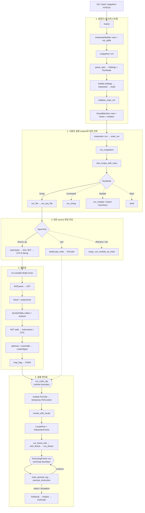
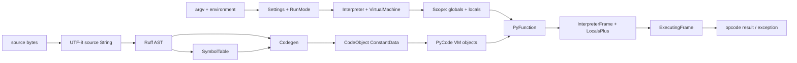

# RustPython `main()`에서 사용자 코드 런타임 진입까지

기준 checkout: `6d4a0cee9`

기준 경로: `rustpython script.py`, 일반 UTF-8 `.py`, `host_env` 활성화, non-CAPI, tracing/JIT/top-level await 없음

이 문서는 컴파일러 내부만 떼어 보지 않고, 프로세스 진입점에서 CLI 설정, VM 부트스트랩, 파일 로딩, 컴파일, 프레임 생성, 첫 opcode dispatch까지를 연결한다. 디렉터리·zip, `.pyc`, `-c`, `-m`, REPL 등의 차이는 뒤의 분기표에서 따로 다룬다.

## 먼저 잡아야 할 결론

일반 `.py` 파일의 본선 호출 경로는 다음 한 줄로 축약된다.

```text
main
→ rustpython::run
→ parse_opts
→ InterpreterBuilder::interpreter
→ initialize_main_vm
→ Interpreter::run / enter_vm
→ run_rustpython
→ run_file / run_any_file
→ VirtualMachine::compile
→ Ruff parser
→ SymbolTable
→ codegen / CFG / assemble
→ CodeObject
→ PyCode
→ run_code_obj
→ PyFunction::invoke_with_locals
→ InterpreterFrame
→ run_frame_fast / with_iframe
→ run_iframe
→ ExecutingFrame::run
→ execute_instruction
```

경계는 세 개로 나눠 보는 것이 정확하다.

| 경계 | 함수 | 의미 |
|---|---|---|
| VM 준비 완료 | `builder.interpreter()` | 설정·내장 모듈·importlib·encoding·stdio를 갖춘 VM이 만들어짐 |
| 실행 런타임 진입 | `VirtualMachine::run_code_obj()` | 컴파일 산출물 `PyCode`와 namespace `Scope`를 실제 실행 장치로 넘김 |
| 평가 루프 진입 | `ExecutingFrame::run()` | instruction fetch/decode/dispatch 루프가 시작됨 |

`run_code_obj()`와 `ExecutingFrame::run()`을 같은 의미로 부르면 중간의 `PyFunction`, 인자/locals 준비, 프레임 설치 과정이 사라진다.

## 1. 큰 구조



제어 흐름과 데이터 변환을 분리하면 더 단순해진다.



## 2. 일곱 단계로 읽기

| 단계 | 핵심 질문 | 입력 | 출력 | 중심 파일 |
|---|---|---|---|---|
| 1. 프로세스 진입 | 어떤 VM을 만들 것인가? | Cargo features | `InterpreterBuilder` | `src/main.rs`, `src/interpreter.rs` |
| 2. CLI 정규화 | 무엇을 어떻게 실행할 것인가? | argv, env | `Settings`, `RunMode` | `src/settings.rs`, `src/lib.rs` |
| 3. VM 부트스트랩 | Python 실행 환경은 어떻게 만들어지는가? | builder 설정 | `Interpreter`, `VirtualMachine` | `crates/vm/src/vm/interpreter.rs`, `vm/mod.rs` |
| 4. `__main__`과 로더 | source와 namespace는 어디서 오는가? | run mode, path | `Scope`, source 또는 `PyCode` | `src/lib.rs`, `vm/python_run.rs` |
| 5. 컴파일 | source가 어떤 실행 형식으로 바뀌는가? | `&str`, `CompileOpts` | `PyRef<PyCode>` | `vm/compile.rs`, `compiler`, `codegen` |
| 6. 프레임 진입 | code와 namespace는 어떻게 결합되는가? | `PyCode`, `Scope` | `InterpreterFrame` | `vm/mod.rs`, `builtins/function.rs`, `frame.rs` |
| 7. 평가 루프 | instruction은 어디서 실행되는가? | frame state | `ExecutionResult` 또는 예외 | `frame.rs` |

## 3. 단계별 상세 흐름

### 단계 1. `main()`은 VM을 실행하지 않고 builder를 조립한다

`src/main.rs:3`의 `main()`이 하는 일은 세 가지다.

1. `InterpreterBuilder::new()`로 기본 설정과 genesis `Context`를 가진 builder를 만든다.
2. `stdlib` feature가 켜졌으면 `init_stdlib()`로 native module 정의와 frozen/dynamic stdlib 초기화 hook을 등록한다.
3. 완성된 builder를 `rustpython::run()`에 넘긴다.

이 시점의 `InterpreterBuilder`는 VM 자체가 아니라 VM 생성 재료다. `module_defs`, `frozen_modules`, `init_hooks`, `Settings`, `Context`를 들고 있다.

### 단계 2. CLI는 `Settings`와 `RunMode`를 분리한다

`parse_opts()`는 argv와 환경변수를 읽어 서로 성격이 다른 두 결과를 만든다.

- `Settings`: VM 전체의 정책. 예: `sys.argv`, import path, optimize 수준, `safe_path`, site import 여부, warning 옵션, hash seed, stdio 정책.
- `RunMode`: 이번 프로세스에서 무엇을 실행할지 나타내는 단일 선택. `Script`, `Command`, `Module`, `InstallPip`, `Repl`.

이 분리는 중요하다. `-O`는 컴파일 옵션까지 영향을 주는 VM 설정이고, `-c`는 source를 어디서 받을지 정하는 실행 모드다.

일반 `rustpython script.py arg1`은 다음처럼 정규화된다.

```text
Settings.argv = ["script.py", "arg1"]
RunMode = Script("script.py")
```

### 단계 3. `builder.interpreter()`가 VM을 실제로 만든다

`builder.settings(settings).interpreter()`는 `build()`를 거쳐 `initialize_main_vm()`을 호출한다.

`initialize_main_vm()`의 순서는 다음과 같다.

1. `getpath::init_path_config()`와 `PyConfig::new()`로 사용자 설정과 계산된 path를 묶는다.
2. builtin/custom module definitions와 frozen modules를 합친다.
3. hash secret, codec registry, warnings state 등을 포함한 `PyGlobalState`를 만든다.
4. `VirtualMachine::new(ctx, global_state)`로 VM 골격을 만든다.
5. builder에 등록된 init hooks를 실행한다.
6. `VmBootstrapGuard` 안에서 `vm.initialize()`를 실행한다.

`vm.initialize()`는 builtins, `sys`, importlib, encodings, stdio를 초기화한다. 이 과정에서 frozen module import 같은 내부 Python bytecode가 실행될 수 있다. 따라서 프로세스 관점의 “최초 opcode 실행”은 사용자 파일보다 앞설 수 있다. 이 문서에서 말하는 런타임 진입은 **사용자 스크립트의 `PyCode`가 실행되는 경계**다.

### 단계 4. `Interpreter::run()`은 thread context와 종료를 관리한다

non-CAPI 경로에서 `rustpython::run()`은 다음 호출을 한다.

```text
interp.run(|vm| run_rustpython(vm, run_mode))
```

`Interpreter::run()`은 두 동작을 묶는다.

1. `enter()` → `thread::enter_vm()`으로 현재 Rust thread를 VM context에 붙인다.
2. closure 결과가 돌아오면 `finalize()`로 exception을 exit code로 바꾸고, I/O flush, thread shutdown, `atexit`, GC, module finalization을 수행한다.

`run_rustpython()`은 사용자 코드 실행의 CLI orchestration 함수다. 여기서 다음을 수행한다.

- `new_scope_with_main()`으로 `__main__` namespace를 만든다.
- `sys.modules["__main__"]`에 같은 globals dict를 가진 module을 등록한다.
- `warnings`, `site`를 import한다.
- 모드에 맞게 `sys.path[0]`를 정한다.
- `RunMode`를 `run_string`, `run_module`, `run_file`, shell 중 하나로 분기한다.

`Scope`는 컴파일 단계의 lexical symbol table이 아니다. 한 번의 실행에서 사용할 `globals`와 `locals` namespace 쌍이다.

### 단계 5. 일반 스크립트는 file runner에서 source가 된다

`RunMode::Script(path)`는 `run_file(vm, scope, path)`로 간다.

먼저 `get_importer(path, vm)`가 directory나 zip importer를 찾는다. importer가 있으면 `runpy._run_module_as_main("__main__", false)`로 우회한다. 일반 파일이면 script parent directory를 `sys.path[0]`에 넣고 `vm.run_any_file()`을 호출한다.

일반 source 파일의 내부 호출은 다음과 같다.

```text
run_any_file
→ run_simple_file
→ with_simple_run
→ run_simple_file_inner
```

`with_simple_run()`은 `__main__.__dict__`에 필요한 경우 `__file__`과 `__cached__`를 임시로 넣고 실행 후 정리한다. `run_simple_file_inner()`는 입력을 두 갈래로 처리한다.

- `.pyc`: loader의 `get_code("__main__")`가 `PyCode`를 반환한다. source compiler를 건너뛴다.
- source: bytes를 읽고 NUL을 거부한 뒤 `String::from_utf8()`로 변환한다. 그 결과를 `Mode::Exec`로 컴파일한다.

현재 직접 파일 경로는 encoding cookie decoder가 아니라 UTF-8 변환을 직접 사용한다는 점도 경계 분석에서 중요하다.

### 단계 6. 컴파일은 `source → CodeObject → PyCode`의 두 층이다

#### 6.1 VM compile facade

`VirtualMachine::compile()`은 VM의 `CompileOpts`를 가져와 `compile_with_opts()`로 넘긴다. 이 층은 다음을 담당한다.

- tokenizer/string escape warning을 Python warning 체계로 보낸다.
- compiler crate의 오류를 `VmCompileError`로 감싼다.
- warning filter가 warning을 exception으로 승격한 경우 정확한 Python exception category를 보존한다.
- compiler-core의 `CodeObject<ConstantData>`를 VM 소유 `PyRef<PyCode>`로 바꾼다.

#### 6.2 compiler facade와 Ruff parser

compiler crate는 `SourceFile`을 만든 뒤 RustPython `Mode`를 Ruff parser mode로 매핑한다.

```text
Exec      → Module
Eval      → Expression
Single    → Module
BlockExpr → Module
```

`parser::parse()`의 결과는 `ruff_python_ast::Mod`다. 이후 post-parse compatibility validation을 수행하고 codegen crate로 넘긴다.

#### 6.3 codegen과 symbol table

일반 `Mode::Exec` module의 핵심 순서는 다음과 같다.

```text
compile_top_with_syntax_warning_handler
→ future flag 검사
→ AST preprocess
→ compile_program_with_syntax_warning_handler
→ scan_module_symbols
→ SymbolTable::scan_program_with_options
→ SymbolTableBuilder collect pass
→ SymbolTableAnalyzer analyze pass
→ Compiler::compile_program
→ exit_scope
→ CodeInfo::finalize_code
```

symbol table은 이름마다 “AST에서 어떤 정의·사용이 보였는가”를 먼저 수집하고, scope tree를 분석해 `Local`, `Free`, `Cell`, `GlobalExplicit`, `GlobalImplicit` 같은 최종 조회 방식을 결정한다. codegen의 두 번째 AST 순회는 이 결과를 보고 `LoadFast`, `LoadGlobal`, `LoadDeref` 같은 opcode family를 선택한다.

`finalize_code()`는 recorded instruction sequence를 CFG로 정리·최적화하고, stack depth와 locals-plus layout을 계산하고, jump offset을 해결한 뒤 bytecode, line table, exception table을 assemble한다.

#### 6.4 `CodeObject`와 `PyCode`는 같은 층이 아니다

- `CodeObject<ConstantData>`: compiler-core 산출물. VM과 독립적인 문자열·상수 bag을 사용한다.
- `PyCode`: Python object model에 들어간 실행 객체. interned names, Python constants, monitoring/quickening state를 가진다.

`PyCode::new_ref_from_bytecode()`의 `map_bag(PyVmBag(vm))`가 이름을 intern하고 상수를 Python object로 바꾼다. 중첩 함수의 child `CodeObject`도 이때 재귀적으로 child `PyCode`가 된다.

### 단계 7. `run_code_obj()`가 컴파일과 실행을 잇는다

file runner는 컴파일 결과를 다음처럼 실행한다.

```text
vm.run_code_obj(code, scope)
```

이 함수는 module code를 직접 opcode loop에 던지지 않는다.

1. `PyFunction::new(code, scope.globals.clone(), vm)`으로 임시 function object를 만든다.
2. closure를 설정한다.
3. `invoke_with_locals(FuncArgs::default(), scope.locals, vm)`를 호출한다.

이 `PyFunction`은 Python source에 `def`로 선언된 함수가 아니다. `PyCode`와 globals/builtins/closure를 결합하고 기존 function-call/frame 생성 경로를 재사용하기 위한 실행 wrapper다.

### 단계 8. 일반 module code는 stack `InterpreterFrame` fast path를 탄다

`PyFunction::invoke_with_locals()`는 먼저 다음 조건을 본다.

```text
generator || coroutine || async_generator || tracing
```

일반 module code에서 이 조건이 거짓이면 다음 fast path를 사용한다.

1. `LocalsPlus::new_on_datastack()`이 fast locals와 value stack의 통합 저장소를 VM thread data stack에 잡는다.
2. module code는 `NEWLOCALS`가 없으므로 전달된 `scope.locals`를 사용한다. `Scope::with_builtins()`가 기본적으로 locals를 globals와 같은 dict mapping으로 만들었다.
3. `InterpreterFrame::new()`가 code, globals, builtins, function, locals-plus, closure를 묶는다.
4. `run_frame_fast()`가 `with_iframe()`을 통해 frame을 현재 호출 chain에 설치한다.

`with_iframe()`은 단순 전달 함수가 아니다.

- Python recursion limit과 native stack overflow를 검사한다.
- thread-local current-frame pointer를 새 frame으로 바꾼다.
- `iframe.previous`에 이전 frame을 연결한다.
- 필요한 code이면 현재 exception state를 저장·복구한다.
- 실행 중 `sys._getframe()` 등으로 materialize된 frame이 있으면 종료 상태를 동기화한다.

현재 구현에서는 모든 호출이 처음부터 Python-visible `FrameObject`를 만들지 않는다. 보통은 가벼운 `InterpreterFrame`을 쓰고, tracing·generator/coroutine 또는 frame 관찰이 필요할 때 heap `FrameObject`를 만들거나 지연 materialize한다.

### 단계 9. `ExecutingFrame::run()`에서 실제 opcode loop가 시작된다

`run_iframe()`은 `InterpreterFrame`의 raw pointer와 mutable execution state를 빌려 `ExecutingFrame`을 만들고 `exec.run(vm)`을 호출한다.

평가 루프의 핵심은 다음 구조다.

```text
loop {
    idx = lasti
    lasti += 1
    op = code.instructions.read_op(idx)
    arg = code.instructions.read_arg(idx)
    tracing / signal / scheduled-GC safepoint 처리
    result = execute_instruction(op, arg, vm)

    Continue  → 다음 instruction
    Return    → ExecutionResult::Return
    Yield     → ExecutionResult::Yield
    Exception → exception table/traceback 처리 후 handler jump 또는 caller 전파
}
```

따라서 “런타임 진입”을 가장 구체적으로 말하면 다음과 같다.

```text
run_code_obj                  컴파일 산출물이 실행 계층으로 들어감
run_frame_fast / run_frame    실행 frame이 VM의 현재 frame chain에 들어감
ExecutingFrame::run           bytecode fetch/decode/dispatch 시작
execute_instruction           한 instruction의 의미를 실제 수행
```

### 단계 10. 반환은 같은 층을 역순으로 빠져나온다

정상 반환은 `ExecutionResult::Return(PyObjectRef)`로 올라온다. `run_frame_fast()`가 이를 `PyResult`로 바꾸고, `invoke_with_locals()`가 data stack을 해제한다. 최상위 script 결과가 `run_rustpython()`까지 돌아오면 `Interpreter::finalize()`가 프로세스 종료 절차를 수행하고 `u32`를 `std::process::ExitCode`로 변환한다.

## 4. 실행 방식별 분기

| 입력 방식 | 최초 분기 | source compiler | 실행으로 합류하는 방식 |
|---|---|---|---|
| `rustpython file.py` | `RunMode::Script` → `run_file` | `Mode::Exec` | `PyCode` → `run_code_obj` |
| `rustpython file.pyc` | `run_simple_file_inner`의 pyc branch | 생략 | loader가 만든 `PyCode` → `run_code_obj` |
| `rustpython directory` 또는 zip | `get_importer()` 성공 | import machinery가 담당 | `runpy._run_module_as_main` 경유 |
| `rustpython -c '...'` | `RunMode::Command` | `run_string`, `Mode::Exec` | `run_code_obj` |
| `rustpython -m pkg.mod` | `RunMode::Module` | import/runpy 경로가 담당 | module 실행 경로에서 frame/eval loop로 합류 |
| `rustpython` 또는 `rustpython -` | `RunMode::Repl` | shell의 incremental compile | 각 입력 단위가 `PyCode` 실행으로 합류 |
| `host_env` 없음 | CLI가 `read_to_string` | `run_string`, `Mode::Exec` | VM file loader를 우회 |
| tracing 활성화 | `invoke_with_locals` | 동일 | heap `FrameObject` → `run_frame` |
| generator/coroutine 호출 | code flags | 동일 | frame wrapper만 반환; `send`/`await` 때 `resume_gen_frame` |
| `capi` feature | `rustpython::run` 내부 | 대체로 동일 | main/local VM 등록과 finalize 경로가 별도 |

## 5. 핵심 객체의 역할과 수명

| 객체 | 역할 | 만들어지는 지점 | 다음 객체로 넘기는 것 |
|---|---|---|---|
| `InterpreterBuilder` | VM 생성 recipe | `main()` | settings, module defs, frozen modules, hooks |
| `Settings` | VM 정책 | `parse_opts()` | `PyConfig` |
| `RunMode` | 이번 실행의 입력 선택 | `parse_opts()` | `run_rustpython()` dispatch |
| `Interpreter` | main VM 소유 + enter/finalize 관리 | `build()` | `&VirtualMachine` |
| `VirtualMachine` | Python object/runtime 전역 context | `initialize_main_vm()` | compile API, import, frame execution |
| `Scope` | 실행 namespace 쌍 | `new_scope_with_main()` | globals + locals |
| `CodeObject<ConstantData>` | VM 독립 compiler 산출물 | `finalize_code()` | instructions, constants, metadata |
| `PyCode` | Python object가 된 executable code | `new_ref_from_bytecode()` | VM constants + monitoring state |
| `PyFunction` | code와 globals/builtins/closure 결합 | `run_code_obj_with_closure()` | call/frame creation |
| `LocalsPlus` | fast locals + value stack storage | `invoke_with_locals()` | frame execution storage |
| `InterpreterFrame` | 가벼운 실행 frame | `InterpreterFrame::new()` | code, namespace, stack, instruction position |
| `FrameObject` | Python-visible heap frame | tracing/generator/materialization | 장수 frame 및 introspection |
| `ExecutingFrame` | hot loop 동안 frame 내부를 빌리는 façade | `run_iframe()` | opcode dispatch state |

## 6. 핵심 시그니처

아래 줄 번호는 checkout `6d4a0cee9` 기준이다.

### 6.1 프로세스·CLI·실행 모드

```rust
// src/main.rs:3
pub fn main() -> std::process::ExitCode

// src/lib.rs:86
pub fn run(mut builder: InterpreterBuilder) -> ExitCode

// src/settings.rs:212
pub fn parse_opts() -> Result<(Settings, RunMode), lexopt::Error>

// src/lib.rs:232
fn run_rustpython(vm: &VirtualMachine, run_mode: RunMode) -> PyResult<()>

// src/lib.rs:167
fn run_file(vm: &VirtualMachine, scope: Scope, path: &str) -> PyResult<()>
```

```rust
// src/settings.rs:7
pub enum RunMode {
    Script(String),
    Command(String),
    Module(String),
    InstallPip(InstallPipMode),
    Repl,
}
```

### 6.2 builder·interpreter·VM bootstrap

```rust
// src/interpreter.rs:4
pub trait InterpreterBuilderExt {
    fn init_stdlib(self) -> Self;
}

// crates/vm/src/vm/interpreter.rs:168, 182, 273, 287
pub fn new() -> Self
pub fn settings(mut self, settings: Settings) -> Self
pub fn build(self) -> Interpreter
pub fn interpreter(self) -> Interpreter

// crates/vm/src/vm/interpreter.rs:40
fn initialize_main_vm<F>(
    settings: Settings,
    ctx: PyRc<Context>,
    module_defs: Vec<&'static builtins::PyModuleDef>,
    frozen_modules: Vec<(&'static str, FrozenModule)>,
    init_hooks: Vec<InitFunc>,
    init: F,
) -> (VirtualMachine, PyRc<PyGlobalState>)
where
    F: FnOnce(&mut VirtualMachine);

// crates/vm/src/vm/interpreter.rs:373, 404, 425
pub fn enter<F, R>(&self, f: F) -> R
where F: FnOnce(&VirtualMachine) -> R

pub fn run<F>(self, f: F) -> u32
where F: FnOnce(&VirtualMachine) -> PyResult<()>

pub fn finalize(self, exc: Option<PyBaseExceptionRef>) -> u32
```

### 6.3 `__main__`, file loading, VM compile API

```rust
// crates/vm/src/vm/vm_new.rs:300
pub fn new_scope_with_main(&self) -> PyResult<Scope>

// crates/vm/src/vm/python_run.rs:72, 81, 87
pub fn run_any_file(&self, scope: Scope, path: &str) -> PyResult<()>
fn run_simple_file(&self, scope: Scope, path: &str) -> PyResult<()>
fn run_simple_file_inner(
    &self,
    module_dict: &Py<PyDict>,
    scope: Scope,
    path: &str,
) -> PyResult<()>

// crates/vm/src/vm/compile.rs:375
pub fn compile(
    &self,
    source: &str,
    mode: compiler::Mode,
    source_path: impl Into<String>,
) -> Result<PyRef<PyCode>, VmCompileError>

// crates/vm/src/vm/compile.rs:384
pub fn compile_with_opts(
    &self,
    source: &str,
    mode: compiler::Mode,
    source_path: impl Into<String>,
    opts: CompileOpts,
) -> Result<PyRef<PyCode>, VmCompileError>
```

```rust
// crates/vm/src/scope.rs:5
pub struct Scope {
    pub locals: Option<ArgMapping>,
    pub globals: PyDictRef,
}
```

### 6.4 compiler facade·symbol table·codegen

```rust
// crates/compiler/src/lib.rs:5244
pub fn compile_with_syntax_warning_handler<'a>(
    source: &str,
    mode: Mode,
    source_path: &str,
    opts: CompileOpts,
    syntax_warning_handler: &'a mut compile::SyntaxWarningHandler<'a>,
) -> Result<CodeObject, CompileError>

// crates/compiler/src/lib.rs:5201
fn _compile_with_syntax_warning_handler<'a>(
    source_file: SourceFile,
    mode: Mode,
    opts: CompileOpts,
    syntax_warning_handler: Option<&'a mut compile::SyntaxWarningHandler<'a>>,
) -> Result<CodeObject, CompileError>

// crates/codegen/src/compile.rs:402
pub fn compile_top_with_syntax_warning_handler<'a>(
    ast: ruff_python_ast::Mod,
    source_file: SourceFile,
    mode: Mode,
    opts: CompileOpts,
    syntax_warning_handler: Option<&'a mut SyntaxWarningHandler<'a>>,
) -> CompileResult<CodeObject>

// crates/codegen/src/compile.rs:469
fn scan_module_symbols(
    ast: &ast::ModModule,
    source_file: &SourceFile,
    opts: &CompileOpts,
) -> CompileResult<SymbolTable>

// crates/codegen/src/symboltable.rs:177
pub fn scan_program_with_options(
    program: &ast::ModModule,
    source_file: SourceFile,
    allow_top_level_await: bool,
    future_annotations: bool,
    recursion_limit: usize,
) -> SymbolTableResult<Self>

// crates/codegen/src/compile.rs:2732
fn compile_program(
    &mut self,
    body: &ast::ModModule,
    symbol_table: SymbolTable,
) -> CompileResult<()>

// crates/codegen/src/compile.rs:2142
fn exit_scope(&mut self) -> CodeObject

// crates/codegen/src/ir.rs:3958
pub fn finalize_code(
    self,
    opts: &CompileOpts,
) -> InternalResult<CodeObject>
```

### 6.5 runtime bridge·frame·eval loop

```rust
// crates/vm/src/vm/mod.rs:1233
pub fn run_code_obj(&self, code: PyRef<PyCode>, scope: Scope) -> PyResult

// crates/vm/src/vm/mod.rs:1237
pub(crate) fn run_code_obj_with_closure(
    &self,
    code: PyRef<PyCode>,
    scope: Scope,
    closure: Option<PyRef<PyTuple<PyCellRef>>>,
) -> PyResult

// crates/vm/src/builtins/function.rs:176
pub(crate) fn new(
    code: PyRef<PyCode>,
    globals: PyDictRef,
    vm: &VirtualMachine,
) -> PyResult<Self>

// crates/vm/src/builtins/function.rs:553
pub fn invoke_with_locals(
    &self,
    func_args: FuncArgs,
    locals: Option<ArgMapping>,
    vm: &VirtualMachine,
) -> PyResult

// crates/vm/src/frame.rs:892 — impl InterpreterFrame
pub(crate) fn new(
    code: &Py<PyCode>,
    globals: &Py<PyDict>,
    builtins: &PyObject,
    func_obj: Option<&PyObject>,
    localsplus: LocalsPlus,
    locals: FrameLocals,
    closure: &[PyCellRef],
    owner: FrameOwner,
) -> Self

// crates/vm/src/vm/mod.rs:1337, 1812
pub fn run_frame_fast(&self, iframe: &mut InterpreterFrame) -> PyResult
pub fn with_iframe<R>(
    &self,
    iframe: &mut InterpreterFrame,
    f: impl FnOnce(&mut InterpreterFrame) -> PyResult<R>,
) -> PyResult<R>

// crates/vm/src/frame.rs:2188
pub(crate) fn run_iframe(
    iframe: &mut InterpreterFrame,
    vm: &VirtualMachine,
) -> PyResult<ExecutionResult>

// crates/vm/src/frame.rs:2759 — impl ExecutingFrame<'_>
fn run(
    &mut self,
    vm: &VirtualMachine,
) -> PyResult<ExecutionResult>

// crates/vm/src/frame.rs:3310
fn execute_instruction(
    &mut self,
    instruction: Instruction,
    arg: bytecode::OpArg,
    extend_arg: &mut bool,
    vm: &VirtualMachine,
) -> FrameResult
```

## 7. 혼동하기 쉬운 지점

1. `InterpreterBuilder`는 VM이 아니다. `interpreter()`를 호출할 때 VM이 만들어진다.
2. `SymbolTable`과 `Scope`는 다르다. 전자는 compile-time lexical binding 분석 결과이고, 후자는 runtime globals/locals namespace다.
3. `CodeObject`와 `PyCode`는 다르다. 전자는 compiler-core 산출물이고, 후자는 VM object로 변환된 executable code다.
4. module code도 임시 `PyFunction`으로 감싸 실행한다.
5. 모든 실행이 처음부터 `FrameObject`를 만들지는 않는다. 일반 경로는 stack `InterpreterFrame` fast path다.
6. generator/coroutine 함수 호출은 즉시 본문 eval loop에 들어가지 않는다. wrapper를 반환하고 이후 resume 시 실행한다.
7. VM bootstrap 중에도 내부 Python bytecode가 실행될 수 있다. “프로세스 최초 opcode”와 “사용자 스크립트 런타임 진입”은 다른 경계다.
8. `.pyc`, directory/zip, `-m`은 일반 source file loader/compile 본선을 그대로 따르지 않는다.

## 8. 소스를 읽는 권장 순서

전체 구조를 놓치지 않으려면 아래 순서가 가장 짧다.

1. `src/main.rs:3`
2. `src/lib.rs:86`, `167`, `232`
3. `src/settings.rs:111`, `212`
4. `crates/vm/src/vm/interpreter.rs:40`, `273`, `404`
5. `crates/vm/src/vm/vm_new.rs:300`
6. `crates/vm/src/vm/python_run.rs:72`, `87`
7. `crates/vm/src/vm/compile.rs:375`, `384`
8. `crates/compiler/src/lib.rs:5201`, `5244`
9. `crates/codegen/src/compile.rs:402`, `469`, `501`, `2142`, `2732`
10. `crates/codegen/src/symboltable.rs:177`, `1124`
11. `crates/codegen/src/ir.rs:3958`
12. `crates/vm/src/vm/mod.rs:1233`, `1337`, `1812`
13. `crates/vm/src/builtins/function.rs:553`
14. `crates/vm/src/frame.rs:2188`, `2759`, `3310`

## 9. 생성된 시퀀스 다이어그램

- Canonical UML source: `sijun-tmp/rustpython-main-to-runtime-sequence.puml`
- Canonical rendered image: `sijun-tmp/rustpython-main-to-runtime-sequence.png`, `.svg`
- Raw Graphviz DOT source: `sijun-tmp/rustpython-main-to-runtime-sequence.dot`
- DOT chronological sequence image: `sijun-tmp/rustpython-main-to-runtime-sequence-dot.png`, `.svg`

PlantUML 그림은 참여자별 호출과 fast/heap/generator 분기를 보여준다. raw DOT 그림은 같은 내용을 단계 순서 중심으로 압축한다.
